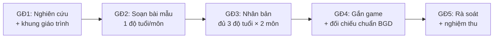

# 📋 BRIEF DỰ ÁN — Giáo trình Toán Tư Duy + Toán Tiếng Anh (Mầm non 3-6 tuổi)

> **Ngày:** 15-07-2026
> **Repo:** dev-ops / task (bộ hồ sơ giao việc)
> **Loại:** Brief (Bản tóm tắt dự án — trả lời câu hỏi TẠI SAO)
> **Quy mô:** LỚN (mảng mới, nhiều tuần, 3 độ tuổi × 2 môn)
> **File này là gì:** Bản tóm tắt 1-2 trang để bất kỳ ai đọc 5 phút là hiểu dự án. Chi tiết "làm gì / làm thế nào" nằm ở PRD + Tech Spec (file 02, 03).

---

## 1. Bối cảnh & Vấn đề (Tại sao phải làm?)

**Thị trường đang cần gì:**
- Phụ huynh mầm non ngày càng chuộng **Toán Tư Duy** (không chỉ dạy đếm số, mà rèn cách con **suy nghĩ**: nhận ra quy luật, phân loại, so sánh, suy luận) và **Toán bằng Tiếng Anh** (cho con quen khái niệm toán + từ vựng toán tiếng Anh từ nhỏ). Đây là 2 mảng "hot", nhiều trung tâm thu học phí cao.
- Xu hướng **đưa AI (trí tuệ nhân tạo) vào lớp mẫu giáo** để hỗ trợ bé + giáo viên — học qua trò chơi nhỏ (mini-game) trên nền tảng số. IruKa vốn là nền tảng **học qua game**, rất hợp để dẫn đầu xu hướng này.

**Khoảng trống của IruKa hiện tại:**
- IruKa **CHƯA có giáo trình** cho 2 môn Toán Tư Duy và Toán Tiếng Anh. Đang có sẵn kho game và nền tảng, nhưng thiếu "bộ khung nội dung học" chuẩn để đổ vào.
- IruKa **CHƯA có kinh nghiệm** ở 2 mảng này → cần một bộ giáo trình bài bản, bám chuẩn Bộ Giáo dục, làm nền móng.

**Nếu KHÔNG làm thì sao (cái giá của việc chậm chân):**
- Mất cơ hội bán 2 dòng sản phẩm đang được phụ huynh săn đón → hụt doanh thu.
- Đối thủ ra giáo trình trước → IruKa bị coi là "đi sau".
- Kho game hiện có không khai thác được hết vì thiếu giáo trình dẫn dắt → lãng phí tài nguyên đã đầu tư.

---

## 2. Mục tiêu (1 câu) + Kết quả đo được

**Mục tiêu (1 câu):**
> Xây dựng bộ **giáo trình chuẩn** cho 2 môn **Toán Tư Duy** và **Toán Tiếng Anh**, phủ **3 độ tuổi mầm non (3-4, 4-5, 5-6)**, bám chuẩn Bộ Giáo dục, và **chuyển được thành các bài học có game** trên nền tảng IruKa.

**Kết quả đo được (khi nào coi là thành công):**

| Chỉ tiêu | Con số mục tiêu |
| --- | --- |
| Số môn hoàn thiện | 2 môn (Toán Tư Duy + Toán Tiếng Anh) |
| Số độ tuổi mỗi môn | 3 (3-4 / 4-5 / 5-6 tuổi) |
| Tổng số "khung × độ tuổi" | 2 × 3 = **6 bộ giáo trình** |
| Số bài học mỗi bộ (gợi ý) | **~24-36 bài** (tương đương ~1 năm học, có thể chốt lại ở PRD) |
| Mỗi bài phải có | Mục tiêu học · 1-2 điểm kiến thức · ≥ 2 game gợi ý · gắn lĩnh vực phát triển + thang Bloom |
| Bằng chứng đạt chuẩn | Có bản đối chiếu với Chương trình GDMN (VBHN 01/2021) của Bộ GD-ĐT |

> **Ghi chú thuật ngữ:**
> - **Điểm kiến thức** = một ý học nhỏ, cụ thể mà bé cần nắm trong bài (ví dụ: "phân biệt to — nhỏ").
> - **Thang Bloom** = cách xếp mức độ tư duy từ dễ đến khó (nhớ → hiểu → vận dụng → …), giúp thiết kế bài vừa sức.
> - **5 lĩnh vực phát triển** = 5 mặt phát triển của trẻ mầm non theo Bộ GD (thể chất, nhận thức, ngôn ngữ, tình cảm-xã hội, thẩm mỹ).
> - **VBHN 01/2021** = Văn bản hợp nhất số 01/2021 — Chương trình Giáo dục Mầm non chính thức của Bộ GD-ĐT (chuẩn phải bám theo).

---

## 3. Phạm vi dự án

### ✅ LÀM (nằm trong dự án này)
1. **Nghiên cứu thị trường**: xem các trung tâm/đối thủ dạy Toán Tư Duy và Toán Tiếng Anh mầm non thế nào, học cái hay.
2. **Xây khung giáo trình**: chia chủ đề, mạch học từ dễ đến khó cho từng độ tuổi.
3. **Soạn bài mẫu**: viết chi tiết một số bài mẫu chuẩn (mục tiêu, điểm kiến thức, hoạt động).
4. **Gắn game**: chọn/gợi ý game phù hợp từng bài (dùng kho game IruKa hoặc đề xuất game cần có).
5. **Bám chuẩn Bộ GD**: đối chiếu với Chương trình GDMN + thang Bloom + 5 lĩnh vực phát triển; lập bảng chứng minh phủ chuẩn.
6. **Định hướng AI trong lớp**: đề xuất cách AI hỗ trợ bé + giáo viên qua mini-game (phần định hướng, không phải code).

### ❌ KHÔNG LÀM (KHOÁ PHẠM VI — thuộc đội khác / giai đoạn sau)
1. **KHÔNG code game** — lập trình game là việc của đội kỹ thuật (game-sdk / game-hub).
2. **KHÔNG làm app / lập trình phần mềm** — việc của đội kỹ thuật.
3. **KHÔNG dạy trực tiếp trên lớp** — dự án này ra *giáo trình*, không phải tổ chức lớp học thật.
4. **KHÔNG tự ý mở rộng sang môn khác** (ví dụ Tiếng Việt, Nghệ thuật) — chỉ 2 môn đã chốt.

> Nếu trong lúc làm phát hiện việc hay ngoài phạm vi → **ghi lại và đề xuất riêng**, KHÔNG tự làm.

---

## 4. Người liên quan

| Vai trò | Ai | Trách nhiệm |
| --- | --- | --- |
| **Người giao việc / Duyệt** | Mr. Đào (CEO IruKa) | Duyệt hồ sơ, duyệt bài mẫu, nghiệm thu cuối |
| **Người thực hiện** | Nhân viên được giao (chưa có kinh nghiệm mảng này) | Nghiên cứu, soạn giáo trình, gắn game, báo cáo tiến độ |
| **Người nghiệm thu chuyên môn** | Chuyên gia/cố vấn sư phạm mầm non (nếu có) | Phản biện giáo trình theo góc nhìn nhà giáo |
| **Người hỗ trợ kỹ thuật** | Đội kỹ thuật IruKa (game-hub) | Cung cấp danh sách game có sẵn, tư vấn game khả thi |
| **Hỗ trợ AI/công cụ** | AI Agent (Claude) trên nền IruKa | Tra chuẩn, dựng bảng, hỗ trợ soạn nháp, đối chiếu |

---

## 5. Các giai đoạn lớn (theo thứ tự — KHÔNG áp thời gian)

> ⏱️ **Bộ đề bài này KHÔNG áp deadline.** Nhân viên đọc khối lượng công việc rồi **tự ước lượng thời gian** từng giai đoạn, đề xuất lại quản lý duyệt. Chi tiết chia việc + phụ thuộc ở file `06 (Chia việc)`.

| Giai đoạn | Kết quả bàn giao |
| --- | --- |
| GĐ1 | Báo cáo thị trường + khung giáo trình 6 bộ |
| GĐ2 | Bài mẫu chuẩn cho 1 độ tuổi × 1 môn (dùng làm hình mẫu) |
| GĐ3 | Soạn đủ bài cho cả 3 độ tuổi × 2 môn |
| GĐ4 | Bảng gắn game từng bài + bảng đối chiếu chuẩn Bộ GD |
| GĐ5 | Rà soát toàn bộ + trình nghiệm thu |

> **Làm chắc từng giai đoạn**, xong cái trước mới sang cái sau. Thời gian mỗi giai đoạn do nhân viên tự ước lượng và cam kết.

---

## 6. Ba rủi ro chính + Cách phòng

| # | Rủi ro | Vì sao nguy hiểm | Cách phòng |
| --- | --- | --- | --- |
| 1 | **Làm sai chuẩn sư phạm** (giáo trình không vừa sức tuổi, không đúng Chương trình GDMN) | Ra sản phẩm không dùng được, phụ huynh/giáo viên không tin | Bám VBHN 01/2021 ngay từ đầu · làm **1 bài mẫu chuẩn duyệt trước** rồi mới nhân bản · nhờ chuyên gia sư phạm phản biện sớm |
| 2 | **Phình phạm vi** (nhân viên sa đà tự nghĩ game, tự bàn app, làm lan man) | Tốn công vào việc không thuộc dự án, kéo dài dự án | Bám mục ❌ KHÔNG LÀM · báo cáo định kỳ để CEO nắn hướng sớm · phát hiện việc ngoài phạm vi thì đề xuất riêng |
| 3 | **Người thực hiện chưa có kinh nghiệm → bí, làm chậm, hiểu sai** | Chất lượng thấp, phải làm lại | Cung cấp **bài mẫu + Tech Spec từng bước** · chốt **người hỗ trợ rõ ràng** để hỏi · nhịp báo cáo cuối ngày để tắc ở đâu gỡ ngay đó |

---

## 7. Đọc tiếp gì?

Sau khi nắm bức tranh lớn ở Brief này, đọc lần lượt:
- `02-prd…` — **LÀM GÌ**: mô tả chi tiết sản phẩm giáo trình.
- `03-huong-dan-nghien-cuu-thi-truong…` — **nghiên cứu ở đâu, thế nào**.
- `04-huong-dan-xay-giao-trinh-va-bai-hoc…` — **LÀM THẾ NÀO** + bài mẫu.
- `05-ai-xuong-day-mau-giao…` — định hướng đưa AI xuống dạy.
- `06-chia-viec…` — ai làm gì, thứ tự (nhân viên **tự ước lượng thời gian**).
- `07-tieu-chi-nghiem-thu…` — **ĐẠT là gì**: tiêu chí "Cho — Khi — Thì".
- `08-nguon-luc-va-cong-cu…` — tài liệu, công cụ, hỏi ai khi tắc.

> Quy trình chung về "cách giao đề bài chuẩn Big Tech" xem workflow `/giao-de-bai-bigtech` (trong `.agent/workflows/`).
