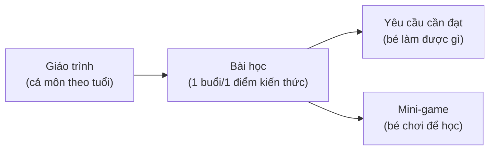
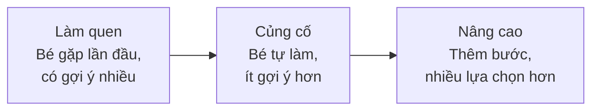

# 02 — PRD: Bản Mô Tả Yêu Cầu Giáo Trình Toán Tư Duy & Toán Tiếng Anh (Mầm Non 3–6 tuổi)

> **Ngày:** 15-07-2026
> **Repo / Bối cảnh:** giao-viec — Giáo trình mầm non IruKa
> **Loại:** PRD (Product Requirements Document — Bản mô tả yêu cầu sản phẩm)
> **Đối tượng đọc:** Nhân viên biên soạn giáo trình CHƯA có kinh nghiệm + giáo viên rà chuyên môn
> **Trạng thái:** Bản nháp chờ Mr. Đào duyệt (mục 9 có câu hỏi cần chốt)

> 📖 **PRD là gì?** Là "bản mô tả yêu cầu" — nó nói rõ **CẦN LÀM RA CÁI GÌ** và **ĐẠT TIÊU CHUẨN NÀO**, chứ chưa nói *làm bằng cách nào*. Bạn (người biên soạn) đọc file này để hiểu đích đến. Cách làm từng bước sẽ nằm ở tài liệu chia việc riêng.

---

## 1. Tóm tắt mục tiêu (đọc 1 phút là hiểu)

Chúng ta xây **giáo trình** (tức là "chương trình học có bài bản, có thứ tự") cho trẻ **mầm non 3–6 tuổi**, chia làm **3 độ tuổi**:

| Nhóm tuổi | Cách gọi trong dự án | Tương đương lớp |
| --- | --- | --- |
| 3–4 tuổi | Mầm | Lớp Mầm |
| 4–5 tuổi | Chồi | Lớp Chồi |
| 5–6 tuổi | Lá | Lớp Lá (chuẩn bị vào lớp 1) |

Có **2 môn học MỚI**:

1. **TOÁN TƯ DUY** — không phải học "làm toán cộng trừ" như tiểu học, mà là **rèn cách suy nghĩ bằng toán**: nhận ra quy luật, phân loại đồ vật, so sánh nhiều–ít, ghép đôi tương ứng, cảm nhận về số lượng (number sense — "cảm giác về số"), nhận biết hình khối & không gian, suy luận logic (nếu... thì...), và giải câu đố.
2. **TOÁN TIẾNG ANH** — học **song ngữ** (2 thứ tiếng): vừa hiểu khái niệm toán, vừa biết **từ vựng toán bằng tiếng Anh** (one, two, big, small, circle, more...). Không dạy tiếng Anh học thuật — chỉ gắn từ tiếng Anh vào đúng khái niệm toán bé đang chơi.

Toàn bộ giáo trình phải:
- Bám **Chương trình Giáo dục Mầm non của Bộ Giáo dục & Đào tạo** (văn bản hợp nhất số **01/VBHN-BGDĐT ngày 13/04/2021** — gọi tắt "VBHN 01/2021").
- Áp **Thang Bloom** (thang đo mức độ tư duy: Nhớ → Hiểu → Vận dụng → Phân tích... — với mầm non chủ yếu dùng 3 mức đầu).
- Nằm trong **5 lĩnh vực phát triển** của trẻ mầm non (thể chất, nhận thức, ngôn ngữ, tình cảm–xã hội, thẩm mỹ). Hai môn này chủ yếu thuộc lĩnh vực **nhận thức** và **ngôn ngữ**.

> 🇬🇧 **Toán Tiếng Anh = môn TĂNG CƯỜNG (ngoài chương trình bắt buộc):** VBHN 01/2021 **không có** nội dung tiếng Anh. Khái niệm toán vẫn bám VBHN; **phần tiếng Anh bám Thông tư 50/2020/TT-BGDĐT** "Cho trẻ mẫu giáo làm quen với tiếng Anh" (hoặc khung Cambridge Early Years). TUYỆT ĐỐI không ghi nguồn "VBHN bản song ngữ".
- Theo triết lý **"học qua chơi"** — trẻ mầm non học bằng trò chơi, không học kiểu ngồi bàn ghi chép.

**Điểm đặc biệt của IruKa:** IruKa là nền tảng **EdTech học qua game** (công nghệ giáo dục — trẻ học bằng mini-game trên app). Nên mỗi **bài học** trong giáo trình phải **gắn được với 1 hoặc nhiều mini-game**. Cấu trúc xuyên suốt:

**Định hướng AI xuống dạy mẫu giáo:** Về sau AI sẽ dựa trên giáo trình chuẩn này để **gợi ý đúng game, đúng độ khó cho từng bé**. Vì vậy giáo trình phải **có cấu trúc rõ, gắn mã, đo được** — nếu viết lộn xộn thì AI không dùng được.

---

## 2. Đối tượng người dùng

> Giáo trình phục vụ 3 nhóm người. Người biên soạn phải hình dung rõ từng nhóm để viết cho đúng.

### 2.1 Trẻ mầm non (người học chính) — đặc điểm nhận thức từng tuổi

| Tuổi | Bé **làm được** gì về mặt suy nghĩ | Hệ quả khi soạn bài |
| --- | --- | --- |
| **3–4 tuổi (Mầm)** | Đếm vẹt 1–5, phân biệt to–nhỏ, nhiều–ít rõ rệt; nhận màu & hình cơ bản (tròn, vuông); chú ý rất ngắn (~5–8 phút); **chưa biết đọc chữ** | Bài cực ngắn, 1 ý duy nhất, dựa **hình ảnh + âm thanh + con vật/đồ vật quen thuộc**. Không dùng chữ để ra đề. |
| **4–5 tuổi (Chồi)** | Đếm 1–10, so sánh dài–ngắn/cao–thấp, ghép đôi tương ứng 1–1, xếp theo quy luật đơn giản (đỏ–xanh–đỏ–xanh); bắt đầu suy luận "vì… nên…" | Có thể thêm 1 bước suy nghĩ; đưa quy luật, phân loại 2 nhóm; vẫn dựa hình + âm thanh. |
| **5–6 tuổi (Lá)** | Đếm & nhận mặt số 1–10 (có bé tới 20), tách–gộp trong phạm vi 10, nhận nhiều hình khối, định hướng không gian (trên–dưới–trước–sau–phải–trái), suy luận logic nhiều bước, giải đố | Bài khó hơn, nhiều bước; chuẩn bị nền cho lớp 1 nhưng **KHÔNG dạy trước chương trình lớp 1** (không viết phép tính, không luyện chữ số kiểu học sinh). |

> ⚠️ **Nguyên tắc vàng chung cho cả 3 tuổi:** trẻ **CHƯA đọc trôi chảy** → mọi đề bài phải hiểu được **qua tranh + tiếng nói (thu âm) + con vật minh hoạ**, không bắt bé đọc chữ mới hiểu đề.

### 2.2 Phụ huynh (người mua & theo dõi)
- Muốn thấy con **học được gì cụ thể**, tiến bộ ra sao.
- Ít rành công nghệ, lo con dùng màn hình nhiều.
- Cần giáo trình **nói rõ mục tiêu bằng tiếng Việt dễ hiểu** ("Sau tuần này bé phân biệt được to–nhỏ").

### 2.3 Giáo viên / người rà chuyên môn (người kiểm định)
- Là giáo viên mầm non có kinh nghiệm, rà xem bài **đúng luật, vừa sức tuổi** không.
- Cần mỗi bài ghi rõ: **yêu cầu cần đạt, độ khó, kỹ năng, nguồn tham khảo** để đối chiếu nhanh.

---

## 3. User stories (Câu chuyện người dùng)

> 📖 **User story là gì?** Là 1 câu ngắn theo mẫu **"Là [ai], tôi muốn [làm gì], để [đạt điều gì]"** — giúp ta không quên mình đang làm cho ai.

**Nhóm bé (người học):**
- Là **bé 3–4 tuổi**, tôi muốn **nhìn tranh + nghe tiếng đọc đề**, để **hiểu phải chọn cái gì mà không cần biết chữ**.
- Là **bé 4–5 tuổi**, tôi muốn **chơi game xếp quy luật màu**, để **học "cái gì đến tiếp theo" một cách vui**.
- Là **bé 5–6 tuổi**, tôi muốn **giải câu đố logic có nhiều bước**, để **rèn suy nghĩ trước khi vào lớp 1**.
- Là **bé học Toán tiếng Anh**, tôi muốn **nghe từ "one, two, three" gắn với số đồ vật**, để **nhớ từ tiếng Anh mà không thấy khó**.

**Nhóm phụ huynh:**
- Là **phụ huynh**, tôi muốn **biết con đang học điểm kiến thức nào**, để **yên tâm con học đúng lứa tuổi**.
- Là **phụ huynh**, tôi muốn **thấy giáo trình bám chương trình Bộ GD**, để **tin đây là học thật chứ không phải chơi vô bổ**.

**Nhóm giáo viên / rà chuyên môn:**
- Là **giáo viên**, tôi muốn **mỗi bài ghi rõ yêu cầu cần đạt + nguồn**, để **rà nhanh xem bài có đúng chuẩn không**.
- Là **người kiểm định**, tôi muốn **có bảng chuẩn (Google Sheet) liệt kê toàn bộ bài**, để **soi mạch học từ dễ đến khó có liền lạc không**.

---

## 4. Yêu cầu về SẢN PHẨM GIÁO TRÌNH

> Đây là phần quan trọng nhất: liệt kê **những thứ phải làm ra**. Cột "Ưu tiên": **Cao** = phải có, làm trước; **TB** = nên có; **Thấp** = có thì tốt, làm sau.

| Mã | Hạng mục | Mô tả (làm ra cái gì) | Ưu tiên |
| --- | --- | --- | --- |
| **YC-01** | Khung chương trình theo độ tuổi | Bản phác toàn cảnh: mỗi môn × mỗi tuổi có bao nhiêu **mảng nội dung** và mạch đi từ dễ → khó. 6 khung (2 môn × 3 tuổi). | Cao |
| **YC-02** | Danh mục chủ đề / kỹ năng Toán tư duy | Liệt kê đầy đủ **các kỹ năng toán tư duy** (nhận biết mẫu, phân loại, so sánh, tương ứng 1–1, number sense, hình khối–không gian, suy luận logic, giải đố, **định hướng thời gian**) — mỗi kỹ năng gắn **mã bất biến** (vd `mtd.pattern`, `mtd.classify`). | Cao |
| **YC-03** | Danh mục từ vựng + khái niệm Toán tiếng Anh | Bảng **từ vựng toán tiếng Anh theo tuổi**: từ + nghĩa tiếng Việt + khái niệm toán gắn kèm + phát âm gợi ý (vd `one/1`, `big–small`, `circle`). Phân tầng từ dễ đến khó. | Cao |
| **YC-04** | Cấu trúc chuẩn của 1 bài học | Quy định **1 bài học gồm những phần nào** (xem mục 5) để mọi bài viết giống khuôn. | Cao |
| **YC-05** | Yêu cầu cần đạt (YCCĐ) mỗi bài | Mỗi bài phải ghi **bé làm được gì sau bài này**, câu chữ **bám VBHN 01/2021**, đo được (quan sát/nghe/chọn được). | Cao |
| **YC-06** | Gắn mini-game cho mỗi bài | Mỗi bài chỉ rõ **loại game phù hợp** + **đề bài game mẫu** (bé phải làm gì trong game). Dùng lại kho game IruKa nếu có. | Cao |
| **YC-07** | Đầu ra dạng bảng chuẩn (Google Sheet) | Toàn bộ giáo trình đổ vào **1 Google Sheet có cột chuẩn** (mã bài, tên, tuổi, môn, kỹ năng, YCCĐ, độ khó, Bloom, game, nguồn) — đây là "bản gốc" để về sau đưa vào hệ thống. | Cao |
| **YC-08** | Phân tầng độ khó mỗi bài | Mỗi bài/điểm kiến thức chia 3 mức: **Làm quen → Củng cố → Nâng cao** (xem mục 7). | TB |
| **YC-09** | Mạch dọc (liền lạc theo tuổi) | Cùng 1 kỹ năng phải nối được từ 3–4 → 4–5 → 5–6 tuổi (dễ đến khó, không nhảy cóc, không lặp y hệt). | TB |
| **YC-10** | Bộ minh hoạ / gợi ý hình–âm thanh | Với mỗi bài, gợi ý **tranh/con vật/âm thanh** để bé chưa biết đọc vẫn hiểu đề. | TB |
| **YC-11** | Thẻ tóm tắt cho phụ huynh | Mỗi tuần/mỗi chủ đề có 1 câu tóm tắt tiếng Việt dễ hiểu cho phụ huynh. | Thấp |
| **YC-12** | Gợi ý cho AI (metadata mở rộng) | Trường dữ liệu phụ giúp AI về sau gợi ý game (vd: kỹ năng chính, kỹ năng phụ, điều kiện mở khoá). | Thấp |

### 4.1 Danh mục kỹ năng Toán tư duy (khởi điểm — người biên soạn hoàn thiện thêm)

| Mã gợi ý | Kỹ năng | Bé làm gì (ví dụ) |
| --- | --- | --- |
| `mtd.pattern` | Nhận biết mẫu / quy luật | Nhìn dãy đỏ–xanh–đỏ–xanh → chọn ô tiếp theo |
| `mtd.classify` | Phân loại | Bỏ con vật vào đúng chuồng theo màu/loại |
| `mtd.compare` | So sánh | Chọn nhóm **nhiều hơn**, cây **cao hơn** |
| `mtd.match` | Tương ứng 1–1 | Mỗi bạn thỏ ghép 1 củ cà rốt |
| `mtd.number` | Number sense (cảm giác số) | Đếm, gộp, nhận số lượng nhanh |
| `mtd.shape` | Hình khối & không gian | Nhận hình tròn/vuông/tam giác; trên–dưới–trước–sau |
| `mtd.logic` | Suy luận logic | "Nếu trời mưa thì cầm ô" — chọn đúng |
| `mtd.puzzle` | Giải đố | Ghép hình, tìm mảnh còn thiếu |
| `mtd.time` | Định hướng thời gian | Sáng/tối; hôm qua/hôm nay/mai; thứ tự sự việc |

> Mã theo **Rule 6.7 (Mã bất biến / Tên đổi được)**: mã đặt 1 lần dùng mãi để gắn game & AI, tên hiển thị có thể đổi sau.

### 4.2 SỐ LƯỢNG BÀI CHUẨN (✅ ĐÃ CHỐT 15-07-2026)

**Quy tắc số bài mỗi mạch, mỗi độ tuổi:**

| Môn | Số bài / mạch / độ tuổi | Ghi chú |
| --- | --- | --- |
| **Toán tư duy** | **4 bài** (linh hoạt 3–6) | Mạch cốt lõi (Số lượng & Đếm) được tới 5–6 bài; mạch phụ tối thiểu 3 |
| **Toán tiếng Anh** | **3 bài** (linh hoạt 2–4) | Ít hơn để tránh quá tải ngôn ngữ (là môn tăng cường) |

> ⚠️ **Chỉ tính mạch ĐANG DẠY ở tuổi đó** (dấu ✅/🔁 ở bảng phân bổ — file 04 Phần 2.3; **bỏ dấu ➖**).

**Chia độ khó trong 4 bài/mạch (Toán tư duy):** **1 Làm quen + 2 Củng cố + 1 Nâng cao**.
→ Không bắt MỖI bài đủ 3 mức; trải đủ 3 mức ở cấp MẠCH là đạt (đây cũng là câu trả lời cho Q3).

**Ước tính tổng khối lượng (6 bộ = 2 môn × 3 tuổi):**

| Bộ | Số mạch đang dạy | Số bài (≈) |
| --- | --- | --- |
| Toán tư duy · 3–4 tuổi | 7 mạch | ~28 |
| Toán tư duy · 4–5 tuổi | 9 mạch | ~36 |
| Toán tư duy · 5–6 tuổi | 9 mạch | ~36 |
| Toán tiếng Anh · 3–4 tuổi | 4 mạch | ~12 |
| Toán tiếng Anh · 4–5 tuổi | 6 mạch | ~18 |
| Toán tiếng Anh · 5–6 tuổi | 7 mạch | ~21 |
| **TỔNG** | | **≈ 150 bài** |

> 💡 ~150 bài ≈ **1 bài/tuần cho 1 năm học (~35 tuần)** mỗi bộ — vừa sức, không quá tải. Làm theo giai đoạn (file 01 + 06): soạn **bộ mẫu 1 tuổi × 1 môn** cho chuẩn trước, rồi nhân bản các bộ còn lại.

---

## 5. Cấu trúc chuẩn của 1 BÀI HỌC (YC-04)

> Mọi bài học phải có đủ các phần dưới đây. Đây là "khuôn" để 100 bài đều giống nhau, dễ kiểm.

| Phần | Nội dung | Bắt buộc? |
| --- | --- | --- |
| Mã bài | Mã bất biến (vd `MTD-45-PATTERN-01`) | ✅ |
| Tên bài | Tên dễ hiểu, tiếng Việt (Toán tiếng Anh thêm tên EN) | ✅ |
| Môn | Toán tư duy / Toán tiếng Anh | ✅ |
| Độ tuổi | 3–4 / 4–5 / 5–6 | ✅ |
| Kỹ năng chính | Chọn từ danh mục YC-02 | ✅ |
| Yêu cầu cần đạt (YCCĐ) | Bé làm được gì, bám VBHN 01/2021, đo được | ✅ |
| Mức Bloom | Nhớ / Hiểu / Vận dụng (mầm non chủ yếu 3 mức này) | ✅ |
| Độ khó | Làm quen / Củng cố / Nâng cao | ✅ |
| Đề bài game mẫu | Mô tả bé phải làm gì trong game (1–3 câu) | ✅ |
| Gợi ý hình–âm thanh | Tranh/con vật/âm thanh để bé chưa biết đọc vẫn hiểu | ✅ |
| Từ vựng EN (chỉ môn Toán tiếng Anh) | Từ tiếng Anh + nghĩa + phát âm gợi ý | ✅ (môn EN) |
| **Lĩnh vực phát triển** | Lĩnh vực GDMN chính + phụ (Nhận thức / Ngôn ngữ / Thể chất-vận động tinh / TC-KNXH / Thẩm mỹ) | ✅ |
| **Tiêu chí đạt (mastery)** | Ngưỡng coi như bé "đã nắm" (vd đúng ≥ 4/5 lượt) — để **AI biết khi nào cho qua bài / nâng độ khó** | ✅ |
| Nguồn tham khảo | **Trích nguyên văn** YCCĐ trong VBHN 01/2021 + mục/trang (không paraphrase). Riêng Toán tiếng Anh: khái niệm → VBHN, phần tiếng Anh → **Thông tư 50/2020/TT-BGDĐT** | ✅ |
| Ghi chú cho AI | Kỹ năng phụ, điều kiện mở khoá (nếu có) | ❌ (nên có) |

---

## 6. Yêu cầu phi chức năng (chất lượng bắt buộc)

> 📖 "Phi chức năng" = không phải "làm ra cái gì" mà là "phải đạt chuẩn nào". Vi phạm mục này thì dù có đủ bài vẫn **không đạt**.

| Mã | Yêu cầu | Nghĩa dễ hiểu |
| --- | --- | --- |
| **PCN-01** | Đúng độ tuổi (vừa sức) | Bài không quá khó/quá dễ so với tuổi; an toàn, không gây áp lực. |
| **PCN-02** | An toàn cho trẻ | Không hình ảnh bạo lực/đáng sợ; con vật, màu sắc thân thiện; không nội dung người lớn. |
| **PCN-03** | Tuân luật sở hữu trí tuệ | **KHÔNG chép nguyên văn sách giáo khoa hay tài liệu có bản quyền.** Chỉ tham khảo chuẩn rồi **tự viết lại**. Hình dùng phải có quyền dùng. |
| **PCN-04** | Truy nguồn được | Mỗi bài chỉ rõ **dựa vào điều/mục nào** của chương trình Bộ GD — để ai cũng kiểm chứng lại được. |
| **PCN-05** | Đo được | YCCĐ phải viết kiểu **quan sát được** ("bé chọn đúng nhóm nhiều hơn"), không viết chung chung ("bé hiểu về số"). |
| **PCN-06** | Nhất quán mã | Tất cả kỹ năng/bài/game gắn bằng **mã bất biến**, tên hiển thị để riêng (Rule 6.7). |
| **PCN-07** | Dữ liệu chuẩn Sheet | Bảng đầu ra đúng cột, đúng định dạng để về sau máy đọc được, không lộn xộn. |

---

## 7. Trường hợp đặc biệt / khó (phải xử lý ngay từ khâu soạn)

### 7.1 Bé chưa biết đọc → dựa hình + âm thanh
- Mọi đề bài phải hiểu được **qua tranh + thu âm giọng đọc + con vật minh hoạ**.
- **Không** đặt đề mà bé phải đọc chữ mới hiểu.
- Nút bấm, lựa chọn trong game là **hình/con vật**, không phải chữ.

### 7.2 Song ngữ (Toán tiếng Anh) → tránh quá tải
- Mỗi bài Toán tiếng Anh chỉ đưa **1–3 từ mới**, không nhồi.
- Luôn gắn từ tiếng Anh vào **khái niệm bé ĐÃ biết bằng tiếng Việt** (đã học "to–nhỏ" rồi mới thêm "big–small").
- Có **giọng đọc mẫu** từ tiếng Anh; không bắt bé đọc chữ tiếng Anh.

### 7.3 Độ khó phân tầng (Làm quen / Củng cố / Nâng cao)

- Mỗi điểm kiến thức nên có đủ 3 mức để bé yếu vẫn theo được, bé giỏi không chán.
- Mức Nâng cao của tuổi nhỏ **không được vượt** mức Làm quen của tuổi lớn hơn (giữ mạch dọc).

### 7.4 Trẻ khác nhau về tốc độ
- Giáo trình cần cho phép bé đi **chậm/nhanh khác nhau** — nên mỗi kỹ năng có nhiều bài cùng mức để lặp lại mà không nhàm.

---

## 8. Ràng buộc & giả định

- **Ràng buộc:** bám VBHN 01/2021; không chép bản quyền; dữ liệu cuối đổ vào Google Sheet chuẩn; mọi mối nối dùng mã bất biến.
- **Giả định:** kho mini-game IruKa đã có sẵn nhiều game dùng lại được; giọng đọc (thu âm) có bộ phận khác lo; hình minh hoạ sẽ được cấp quyền dùng hợp lệ.

---

## 9. Câu hỏi còn mở — cần Mr. Đào quyết trước khi làm

> Người biên soạn **KHÔNG tự quyết** các câu này. Chờ Mr. Đào chốt để tránh làm lại.

| # | Câu hỏi | Vì sao cần chốt |
| --- | --- | --- |
| ~~**Q1**~~ | ✅ **ĐÃ CHỐT** — Toán tư duy 4 bài/mạch/tuổi, Toán tiếng Anh 3 bài/mạch/tuổi (tổng ≈150 bài). Xem **mục 4.2** | *(đã quyết)* |
| **Q2** | **Tỉ lệ tiếng Anh** trong môn Toán tiếng Anh: chỉ thêm từ vựng, hay đề bài cũng bằng tiếng Anh? | Ảnh hưởng độ khó & cách viết bài. |
| ~~**Q3**~~ | ✅ **ĐÃ CHỐT** — KHÔNG bắt mỗi bài đủ 3 mức; trải đủ Làm quen/Củng cố/Nâng cao ở cấp MẠCH (1+2+1 trong 4 bài). Xem **mục 4.2** | *(đã quyết)* |
| **Q4** | Mỗi bài gắn **1 game hay nhiều game**? Ưu tiên dùng lại game cũ hay đề xuất game mới? | Quyết cách gắn game & phối hợp với đội game. |
| **Q5** | Toán tư duy và Toán tiếng Anh **soạn song song** hay **xong 1 môn rồi tới môn kia**? | Quyết thứ tự giao việc. |
| **Q6** | Ngoài VBHN 01/2021, có **tài liệu chuẩn nào khác** được phép tham khảo (vd chuẩn phát triển trẻ 5 tuổi)? | Bảo đảm truy nguồn hợp lệ. |

---

## 10. Tiêu chí thành công (tóm tắt — chi tiết ở file 07)

Dự án coi là thành công khi:
1. Có đủ 6 khung chương trình (2 môn × 3 tuổi) + danh mục kỹ năng + danh mục từ vựng EN.
2. Mọi bài đúng cấu trúc chuẩn, có YCCĐ đo được, bám VBHN 01/2021, có nguồn.
3. Không bài nào chép bản quyền; bé chưa biết đọc vẫn hiểu đề (hình + âm thanh).
4. Toàn bộ đổ vào Google Sheet chuẩn, gắn mã, giáo viên rà PASS.

---

_File này là bản nháp chờ duyệt. Sau khi Mr. Đào trả lời mục 9, người biên soạn mới bắt đầu soạn nội dung._
