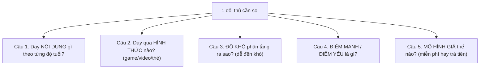
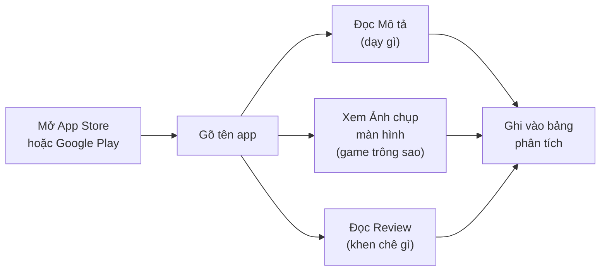
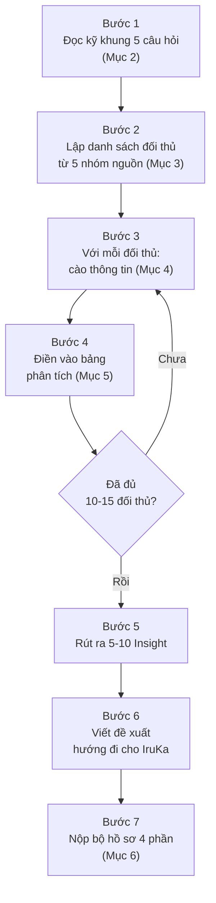

# 📊 Hướng Dẫn Nghiên Cứu Thị Trường — Giáo Trình Toán Tư Duy + Toán Tiếng Anh (Mầm Non 3-6 Tuổi)

> **Ngày:** 15-07-2026
> **Repo / Dự án:** Giáo trình Toán tư duy + Toán tiếng Anh mầm non IruKa
> **Loại:** Tài liệu hướng dẫn (giao việc cho nhân viên chưa có kinh nghiệm)
> **Người đọc:** Nhân viên nghiên cứu thị trường (chưa cần biết kỹ thuật, chưa có kinh nghiệm mảng này)

---

## 📌 Giải thích nhanh vài từ hay gặp (đọc 1 lần rồi dùng cả tài liệu)

Vì bạn có thể chưa quen, mình giải thích trước một số từ tiếng Anh sẽ xuất hiện nhiều:

| Từ | Nghĩa dễ hiểu |
| --- | --- |
| **Đối thủ** (competitor) | Công ty / ứng dụng khác cũng dạy toán cho trẻ, mình cần học từ họ |
| **App Store / Google Play** | 2 "chợ" tải ứng dụng: App Store cho iPhone/iPad, Google Play cho điện thoại Android |
| **Review** | Đánh giá của người dùng thật để lại trên chợ ứng dụng (mấy sao, khen chê gì) |
| **Demo** | Video quay lại cảnh chơi thử ứng dụng, thường có trên YouTube |
| **Insight** | "Bài học rút ra" — điều hay ho mình nhận ra sau khi nghiên cứu |
| **Bản quyền** (copyright) | Quyền sở hữu nội dung. Chép nguyên của người khác là phạm luật, bị kiện |
| **Freemium** | Mô hình "dùng thử miễn phí, muốn dùng đầy đủ thì trả tiền" |
| **Số học / number sense** | Cảm giác về con số — trẻ hiểu "3 nhiều hơn 2", đếm được, so sánh được |
| **Subitizing** | Nhìn nhanh 1 nhóm đồ vật là biết ngay bao nhiêu cái, không cần đếm từng cái (vd nhìn 3 chấm biết ngay là 3) |
| **CPA (Cụ thể – Hình ảnh – Trừu tượng)** | Cách dạy toán của Singapore: cho trẻ sờ đồ vật thật → xem hình → rồi mới đến con số |

---

## 1. 🎯 Mục Tiêu Nghiên Cứu (Vì sao phải làm việc này?)

IruKa sắp xây một **giáo trình mới**: dạy **Toán tư duy** (dạy trẻ suy nghĩ, giải quyết vấn đề bằng con số, hình khối) và **Toán tiếng Anh** (học toán bằng tiếng Anh, vd đếm "one, two, three") cho trẻ **3-6 tuổi**, học qua **mini-game** (trò chơi nhỏ trên app).

**Vấn đề:** IruKa **chưa từng làm 2 mảng này** → dễ làm sai, làm thiếu, hoặc làm trùng cái người ta đã làm tốt hơn. Vì vậy **phải nghiên cứu thị trường TRƯỚC KHI bắt tay xây**.

Nghiên cứu thị trường nhắm tới **4 mục tiêu**:

| # | Mục tiêu | Giải thích |
| --- | --- | --- |
| 1 | **Học đối thủ làm gì HAY** | Cái gì họ làm tốt → mình học theo (vd cách dạy đếm rất vui, hình vẽ dễ thương) |
| 2 | **Thấy đối thủ làm gì DỞ** | Cái gì họ làm chưa tốt → mình tránh + làm tốt hơn (vd game khó quá trẻ khóc, quảng cáo nhiều) |
| 3 | **Tìm CHUẨN nội dung** | Trẻ 3 tuổi nên học gì, 5 tuổi nên học gì cho đúng khoa học → bám theo tài liệu chuẩn |
| 4 | **Tìm KHOẢNG TRỐNG để khác biệt** | Chỗ nào chưa ai làm tốt → IruKa nhảy vào để nổi bật (vd toán tiếng Anh cho trẻ Việt còn ít) |

> 💡 **Nói ngắn gọn:** Nghiên cứu để "biết người biết ta" — biết người ta làm gì rồi mới biết mình nên làm gì cho hay hơn, khác đi, và đúng chuẩn.

---

## 2. 🔍 Nghiên Cứu CÁI GÌ — Khung 5 Câu Hỏi (Học thuộc khung này!)

Với **mỗi đối thủ** bạn xem, luôn luôn tự trả lời **5 câu hỏi** sau. Đây là "kim chỉ nam" — đừng xem lan man, cứ bám 5 câu này:

**Giải thích từng câu + ví dụ điều cần ghi lại:**

| Câu hỏi | Bạn tìm gì | Ví dụ câu trả lời |
| --- | --- | --- |
| **1. Dạy nội dung gì theo tuổi?** | Trẻ 3 tuổi họ dạy đếm đến mấy? 5 tuổi dạy cộng trừ chưa? | "App X: 3 tuổi đếm 1-5, 4 tuổi đếm 1-10, 5 tuổi cộng trong phạm vi 10" |
| **2. Dạy qua hình thức nào?** | Trò chơi tương tác? Video hoạt hình? Thẻ hình (flashcard)? Kể chuyện? | "App Y chủ yếu game kéo-thả + có nhân vật dẫn chuyện" |
| **3. Độ khó phân tầng ra sao?** | Có chia cấp độ dễ → khó không? Trẻ làm đúng thì có lên cấp không? | "App Z chia 3 mức: Mầm / Chồi / Lá, làm hết mức này mới mở mức sau" |
| **4. Điểm mạnh / điểm yếu?** | Cái gì hay (đồ họa đẹp, âm thanh vui)? Cái gì dở (quảng cáo, khó, đắt)? | "Mạnh: hoạt hình đẹp. Yếu: nhiều tiếng Anh, trẻ Việt khó hiểu" |
| **5. Mô hình giá?** | Miễn phí hoàn toàn? Freemium? Trả theo tháng/năm? Bao nhiêu tiền? | "Freemium: 10 bài đầu free, mở khóa full 199k/tháng" |

> ⚠️ **Lưu ý:** Không cần trả lời hoàn hảo cả 5 câu cho mọi app. Nhưng **tối thiểu phải có câu 1, 2, 4** (nội dung, hình thức, mạnh/yếu). Đó là 3 câu quan trọng nhất.

---

## 3. 🌐 Nghiên Cứu Ở ĐÂU — Danh Sách Nguồn Cụ Thể

Đây là phần quan trọng nhất. Mình chia làm **5 nhóm nguồn**. Bạn không cần làm hết ngay — làm theo thứ tự từ nhóm A xuống.

### 🅰️ Nhóm A — Đối thủ QUỐC TẾ về Toán tư duy / số học mầm non

Đây là các ứng dụng nước ngoài nổi tiếng dạy toán/số học cho trẻ nhỏ. Bạn **tải về (hoặc xem mô tả + video) để học cách họ làm**.

| Tên ứng dụng | Nước | Xem ở đâu | Chú ý gì |
| --- | --- | --- | --- |
| **Khan Academy Kids** | Mỹ | App Store, Google Play, khanacademy.org/kids | Miễn phí, rất chuẩn giáo dục — nghiên cứu kỹ |
| **Todo Math** | Mỹ | App Store, Google Play | Chuyên toán, chia độ tuổi rõ ràng |
| **Monkey Math** | (có bản quốc tế) | App Store, Google Play, monkey.edu.vn | Có cả bản Việt Nam — so sánh 2 bản |
| **Kids Academy** | Mỹ | App Store, kidsacademy.mobi | Nhiều dạng bài, có phiếu bài tập |
| **Endless Numbers** | Mỹ | App Store | Dạy nhận mặt số rất sáng tạo |
| **Moose Math** | Mỹ (Duck Duck Moose) | App Store, Google Play | Miễn phí, dạy đếm/cộng/trừ qua trò chơi |
| **Thinkrolls** | (Avokiddo) | App Store, Google Play | Mạnh về tư duy logic, giải đố |
| **DragonBox Numbers** | Na Uy | App Store, Google Play | Dạy số qua nhân vật "Nooms" rất độc đáo |
| **Montessori math apps** | (nhiều hãng) | Search "Montessori math" trên chợ app | Theo phương pháp Montessori — sờ, chạm, tự khám phá |
| **Bedtime Math** | Mỹ | bedtimemath.org | Toán qua câu chuyện đời thường (không phải app game) |

**Cách khai thác nhóm A (làm theo thứ tự):**
1. **Mở App Store / Google Play** trên điện thoại hoặc máy tính → gõ tên app → đọc **phần Mô tả** (họ tự giới thiệu dạy gì) + xem **ảnh chụp màn hình** (thấy game trông thế nào) + đọc **Review** (người dùng khen chê gì, để ý review 5 sao và 1 sao).
2. **Lên YouTube** gõ "*tên app* + gameplay" hoặc "*tên app* + demo" → xem video người ta chơi thử → **thấy tận mắt** cách chơi, độ khó.
3. **Vào website** của app (nếu có) → đọc phần "Curriculum" / "Chương trình học" → thấy họ chia nội dung theo tuổi.

### 🅱️ Nhóm B — Đối thủ Toán TIẾNG ANH / Song ngữ

Các app dạy học (nhất là tiếng Anh + toán) cho trẻ. Học cách họ dạy toán **bằng tiếng Anh**.

| Tên | Xem ở đâu | Chú ý gì |
| --- | --- | --- |
| **Monkey Math / Monkey Junior** | monkey.edu.vn, App Store | Của VN, dạy toán/tiếng Anh song ngữ — đối thủ TRỰC TIẾP quan trọng nhất |
| **Duolingo ABC** | App Store, Google Play | Miễn phí, dạy chữ + số bằng tiếng Anh, giao diện rất chuẩn |
| **Lingokids** | App Store, lingokids.com | Học tiếng Anh qua chủ đề, có mảng số đếm |
| **Khan Academy Kids** | (đã có ở nhóm A) | Bản tiếng Anh — xem cách họ đọc số bằng tiếng Anh |
| **ABCmouse** | App Store, abcmouse.com | Chương trình lớn của Mỹ, đủ môn gồm toán |
| **Starfall** | starfall.com | Web học chữ + số tiếng Anh lâu đời, nhiều bài free |

**Cách khai thác:** Giống nhóm A. Riêng nhóm này chú ý thêm: **họ đọc con số bằng tiếng Anh thế nào** (có phát âm mẫu không?), **trẻ Việt có hiểu được không** (có phụ đề / hình minh họa không?).

### 🇻🇳 Nhóm C — Đối thủ / Mô hình VIỆT NAM

Rất quan trọng vì đây là thị trường IruKa nhắm tới. Nhiều cái là **trung tâm dạy trực tiếp** (không phải app), nhưng vẫn học được phương pháp.

| Tên | Loại | Xem ở đâu |
| --- | --- | --- |
| **POMath** | Trung tâm toán tư duy | pomath.vn, Facebook |
| **UCMAS / Soroban (bàn tính)** | Toán trí tuệ bằng bàn tính | ucmas.vn, search "soroban trẻ em" |
| **Kumon** | Trung tâm toán (Nhật) | kumon.com.vn |
| **Eye Level (Mắt Việt)** | Trung tâm toán tư duy | myeyelevel.com |
| **Mathnasium** | Trung tâm toán (Mỹ, có ở VN) | mathnasium.vn |
| **Các trung tâm toán tư duy VN khác** | Trung tâm | Search "toán tư duy cho bé", "toán soroban mầm non" |
| **Vmonkey / Monkey Math (bản VN)** | App | monkey.edu.vn |
| **KidsUP** | App toán tư duy VN | kidsup.net |
| **Cùng con học toán** | App/kênh VN | Search trên chợ app + YouTube |

**Cách khai thác nhóm C:**
- Với **app**: giống nhóm A.
- Với **trung tâm** (POMath, Kumon...): vào **website + Facebook** đọc cách họ mô tả chương trình, xem **học phí**, đọc **bài viết blog** của họ (thường giải thích phương pháp). Xem **YouTube** nếu họ có kênh dạy mẫu.
- **Đặc biệt chú ý:** ghi lại **họ dùng phương pháp nào** (Soroban? Montessori? Finger Math?) và **giá bao nhiêu** — để IruKa định giá cho hợp thị trường Việt.

### 📚 Nhóm D — Nguồn CHUẨN NỘI DUNG (để BÁM, KHÔNG CHÉP)

Đây **không phải đối thủ** — đây là **tài liệu chuẩn khoa học** để biết trẻ mỗi tuổi nên học gì. IruKa bám theo để làm đúng, **nhưng không chép nguyên văn**.

| Nguồn | Là gì | Tìm ở đâu |
| --- | --- | --- |
| **Chương trình GDMN Bộ GD-ĐT (VBHN 01/2021)** | Luật giáo dục mầm non VN — quy định trẻ VN mỗi tuổi học gì | Search "Văn bản hợp nhất 01/2021 chương trình giáo dục mầm non" |
| **Chuẩn phát triển trẻ 5 tuổi** | Bộ chuẩn: trẻ 5 tuổi cần đạt gì về toán | Search "Bộ chuẩn phát triển trẻ em 5 tuổi" |
| **Common Core Math — Kindergarten (Mỹ)** | Chuẩn toán mẫu giáo Mỹ | corestandards.org → Math → Kindergarten |
| **Singapore Math (phương pháp CPA)** | Cách dạy toán nổi tiếng: Cụ thể → Hình ảnh → Trừu tượng | Search "Singapore Math CPA approach preschool" |
| **Montessori** | Phương pháp cho trẻ tự sờ, chạm, khám phá | Search "Montessori math preschool activities" |
| **Phương pháp Số học Glenn Doman** | Dạy nhận số lượng bằng thẻ chấm (dot cards) | Search "Glenn Doman math dot cards" |
| **NCTM** | Hội đồng giáo viên toán Mỹ — tài liệu chuẩn quốc tế | nctm.org |

> ⚠️ **CỰC KỲ QUAN TRỌNG:** Nhóm D dùng để **hiểu chuẩn** — "à, trẻ 4 tuổi nên đếm được đến 10". Bạn **học ý tưởng và cấu trúc**, rồi IruKa **tự viết nội dung riêng**. Tuyệt đối **không copy-paste** bài học của người ta.

### 🎓 Nhóm E — Nguồn HỌC THUẬT / Uy tín (kiến thức nền)

Đọc để hiểu **vì sao** dạy toán cho trẻ nhỏ lại quan trọng, dạy sao cho đúng khoa học.

| Chủ đề tìm kiếm | Bạn học được gì |
| --- | --- |
| **"number sense" (cảm giác số)** | Vì sao trẻ cần "cảm" được con số trước khi làm phép tính |
| **"subitizing" (nhận nhanh số lượng)** | Kỹ năng nhìn nhóm đồ vật biết ngay số lượng — nền tảng toán |
| **Báo cáo giáo dục sớm (early childhood math)** | Xu hướng, nghiên cứu mới nhất về dạy toán mầm non |

**Cách khai thác:** Search trên Google Scholar (scholar.google.com) hoặc Google thường với các từ khóa trên + "preschool" / "early childhood". Đọc phần tóm tắt là đủ, không cần đọc hết bài nghiên cứu dài.

---

## 4. 🛠️ CÀO / THU THẬP THẾ NÀO — Cách Làm Cụ Thể + Công Cụ

"Cào" ở đây nghĩa là **thu thập thông tin** (không phải viết code gì cả). Đây là các cách làm cụ thể:

### 4.1. Đọc App Store / Google Play (nguồn giàu thông tin nhất)

- **Phần Mô tả (Description):** họ tự nói dạy gì, cho tuổi nào → chép ý chính vào bảng.
- **Ảnh chụp màn hình:** nhìn thấy giao diện game → ghi nhận xét (đẹp/xấu, dễ/khó hiểu).
- **Review (đánh giá):** đọc cả review **5 sao** (biết cái họ làm tốt) và **1-2 sao** (biết cái họ làm dở, chính là cơ hội cho IruKa). Chú ý review của **phụ huynh Việt** nếu có.

### 4.2. Xem Demo trên YouTube

- Gõ: `tên app + gameplay` hoặc `tên app + review` hoặc `tên app + walkthrough`.
- Xem 2-5 phút đầu là đủ hình dung. Chú ý: cách vào game, độ khó bài đầu, có vui không, âm thanh/hình ảnh thế nào.

### 4.3. Đọc Blog giáo dục + Website đối thủ

- Vào website đối thủ → tìm mục "Curriculum" / "Chương trình" / "Phương pháp" / "Blog".
- Blog thường giải thích **phương pháp dạy** rất chi tiết — mỏ vàng để học.

### 4.4. Dùng công cụ tìm kiếm + AI để tổng hợp nhanh

- Search Google với câu hỏi thẳng, ví dụ: *"best math apps for preschoolers 3-6 years old"*, *"toán tư duy cho bé mầm non phương pháp nào"*.
- Nếu bạn có quyền dùng **công cụ AI tìm kiếm web (như Tavily, Exa qua trợ lý AI)** → nhờ AI **tổng hợp** danh sách + so sánh nhanh. **Nhưng phải tự kiểm chứng lại** (AI đôi khi nói sai) bằng cách mở nguồn gốc ra xem.

> ⚠️ **CẢNH BÁO BẢN QUYỀN (đọc kỹ):** Khi cào thông tin, bạn **CHỈ được THAM KHẢO ý tưởng và cấu trúc** (vd "à, họ chia 3 cấp độ, dạy đếm trước rồi mới cộng"). **TUYỆT ĐỐI KHÔNG:**
> - Tải nguyên bộ bài / hình vẽ / nhạc của người ta về dùng lại.
> - Chép nguyên văn câu chữ, tên bài, lời thoại nhân vật.
> - Chụp màn hình game của họ rồi bê vào sản phẩm IruKa.
>
> Học **cách làm**, rồi **tự sáng tạo nội dung riêng của IruKa**. Chép = phạm luật bản quyền, bị kiện, hại cả công ty.

---

## 5. 📝 GHI CHÉP THẾ NÀO — Template Bảng Phân Tích Đối Thủ

Mỗi đối thủ = **1 dòng** trong bảng dưới. Đây là bảng chuẩn, bạn copy vào Google Sheet hoặc file Word rồi điền dần.

**Các cột cần có:** Tên / Nước / Độ tuổi / Nội dung dạy / Hình thức / Độ khó / Điểm mạnh / Điểm yếu / Bài học cho IruKa.

**Ví dụ ĐÃ ĐIỀN MẪU (3 dòng — làm theo kiểu này):**

| Tên | Nước | Độ tuổi | Nội dung dạy | Hình thức | Độ khó | Điểm mạnh | Điểm yếu | Bài học cho IruKa |
| --- | --- | --- | --- | --- | --- | --- | --- | --- |
| **Khan Academy Kids** | Mỹ | 2-7 | Đếm, nhận số, so sánh nhiều/ít, hình khối, cộng trừ cơ bản | Game tương tác + có nhân vật dẫn (con gấu Kodi) + kể chuyện | Chia theo tuổi, tự tăng dần | Miễn phí 100%, đồ họa dễ thương, chuẩn giáo dục cao | Toàn tiếng Anh, trẻ Việt khó theo nếu không có người lớn kèm | Học cách nhân vật dẫn dắt + tự tăng độ khó. IruKa nên có bản TIẾNG VIỆT + phát âm tiếng Anh song song |
| **Monkey Math** | VN (bản quốc tế) | 3-8 | Đếm, cộng trừ, hình học, đo lường — dạy bằng tiếng Anh | Video + game + flashcard, có phát âm chuẩn | 3 cấp độ theo lớp | Song ngữ tốt, phát âm tiếng Anh chuẩn, thương hiệu mạnh ở VN | Trả phí khá cao, nhiều nội dung khiến trẻ nhỏ dễ ngợp | Đối thủ trực tiếp mạnh nhất. IruKa cần KHÁC BIỆT: game vui hơn + giá dễ chịu hơn |
| **POMath** | VN | 4-11 | Toán tư duy: logic, quan sát, giải đố (không chỉ tính toán) | Học trực tiếp tại trung tâm + giáo cụ | Theo lộ trình từng cấp | Phương pháp tư duy bài bản, có giáo viên kèm | Học offline, học phí cao, không tiện tại nhà | IruKa có thể đưa "toán tư duy kiểu POMath" lên APP để học ở nhà, rẻ hơn |

> 💡 **Mẹo điền bảng:**
> - Cột **"Bài học cho IruKa"** là **QUAN TRỌNG NHẤT** — đây là chỗ bạn suy nghĩ, không chỉ chép. Luôn tự hỏi: "IruKa nên học gì / tránh gì / làm khác gì?"
> - Nếu ô nào chưa tìm ra thông tin, ghi "**Chưa rõ**" thay vì bỏ trống — để biết còn thiếu gì.
> - Nên làm trên **Google Sheet** để dễ lọc, sắp xếp, chia sẻ.

---

## 6. 📦 ĐẦU RA Nghiên Cứu — Bạn Phải Nộp Gì?

Sau khi làm xong, bạn nộp **1 bộ hồ sơ gồm 4 phần**:

| # | Sản phẩm | Mô tả |
| --- | --- | --- |
| 1 | **Báo cáo tổng hợp** | 1 file (Word/Google Doc) tóm tắt: đã xem bao nhiêu đối thủ, bức tranh chung thị trường thế nào |
| 2 | **Bảng so sánh đối thủ** | Chính là bảng ở Mục 5, điền đầy đủ (tối thiểu 10-15 đối thủ) |
| 3 | **5-10 Insight (bài học rút ra)** | Danh sách các điều quan trọng nhận ra — xem ví dụ dưới |
| 4 | **Đề xuất hướng đi khác biệt cho IruKa** | 3-5 gợi ý: IruKa nên làm gì để nổi bật so với đối thủ |

**Ví dụ 3 Insight mẫu (viết theo kiểu này):**
> - **Insight 1:** Đa số app quốc tế rất hay nhưng **toàn tiếng Anh** → trẻ Việt cần người lớn kèm. → **Cơ hội:** IruKa làm bản Việt hóa hoàn toàn nhưng vẫn có tiếng Anh song song.
> - **Insight 2:** Đối thủ VN (Monkey Math) mạnh nhưng **giá cao**. → **Cơ hội:** IruKa định giá dễ chịu hơn cho phụ huynh phổ thông.
> - **Insight 3:** Ít app dạy **toán tư duy** (logic, giải đố) — đa số chỉ dạy tính toán. → **Cơ hội:** IruKa nhấn mạnh "toán tư duy" như điểm khác biệt.

---

## 7. 🚨 Cảnh Báo Bản Quyền (Nhắc lại lần cuối — CỰC QUAN TRỌNG)

| ✅ ĐƯỢC làm | ❌ KHÔNG được làm |
| --- | --- |
| Học **cách** đối thủ chia độ tuổi, phân cấp độ khó | Chép nguyên bộ bài / lộ trình học của họ |
| Học **phương pháp** dạy (CPA, Montessori, Soroban...) | Tải hình vẽ, nhân vật, nhạc của app khác về dùng |
| Ghi nhận **ý tưởng** hay rồi tự sáng tạo lại | Chép nguyên văn tên bài, lời thoại, câu đố |
| Chụp màn hình để **phân tích nội bộ** (không public) | Bê ảnh chụp game của họ vào sản phẩm IruKa |
| Trích dẫn số liệu có **ghi rõ nguồn** | Nói số liệu của người khác là của mình |

> **Quy tắc vàng:** *Học cấu trúc & phương pháp → rồi TỰ SÁNG TẠO nội dung của riêng IruKa.* Nếu phân vân "cái này chép có sao không?" → **hỏi quản lý trước khi dùng**.

---

## 8. ✅ Quy Trình Làm Việc Tổng Thể (Sơ đồ tổng kết)

**Gợi ý thứ tự ưu tiên khi thiếu thời gian:**
1. Làm **Nhóm C (Việt Nam)** trước — sát thị trường nhất, quan trọng nhất.
2. Rồi **Nhóm B (Toán tiếng Anh)** — Monkey Math là đối thủ số 1 cần soi kỹ.
3. Rồi **Nhóm A (quốc tế)** — học cái hay để nâng chất lượng.
4. **Nhóm D + E** đọc song song để bám chuẩn + hiểu nền tảng.

---

## 9. 💬 Khi Bí Thì Làm Gì?

- **Không tìm ra thông tin 1 app:** ghi "Chưa rõ", chuyển app khác, quay lại sau.
- **Không chắc 1 nguồn có uy tín không:** ưu tiên nguồn chính thức (website hãng, Bộ GD-ĐT, chợ app chính thức) hơn là blog lạ.
- **Phân vân về bản quyền:** dừng lại, hỏi quản lý.
- **Quá nhiều đối thủ không biết bắt đầu từ đâu:** bám thứ tự ưu tiên ở Mục 8 (VN → Toán tiếng Anh → Quốc tế).

> 🎯 **Nhớ mục tiêu cuối cùng:** Không phải "xem cho biết", mà là để trả lời câu hỏi: **"IruKa nên xây giáo trình Toán tư duy + Toán tiếng Anh cho trẻ 3-6 tuổi NHƯ THẾ NÀO để vừa đúng chuẩn, vừa khác biệt, vừa hay hơn đối thủ?"**

---

*Tài liệu này dành cho nhân viên nghiên cứu thị trường dự án Giáo trình Toán tư duy + Toán tiếng Anh mầm non IruKa. Mọi từ tiếng Anh đều đã được giải thích. Có gì chưa rõ, hỏi ngay quản lý.*
