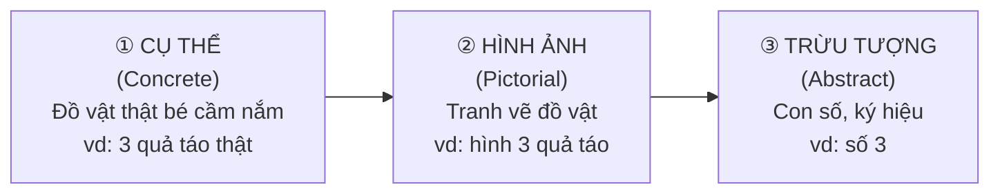
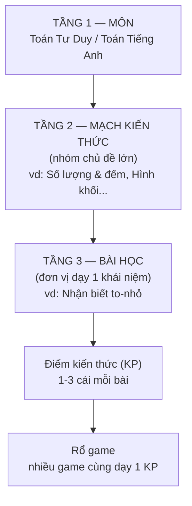
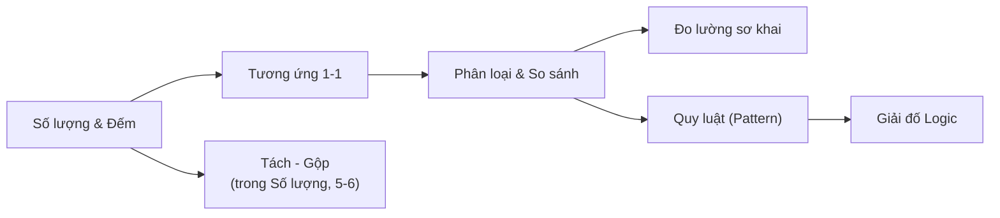
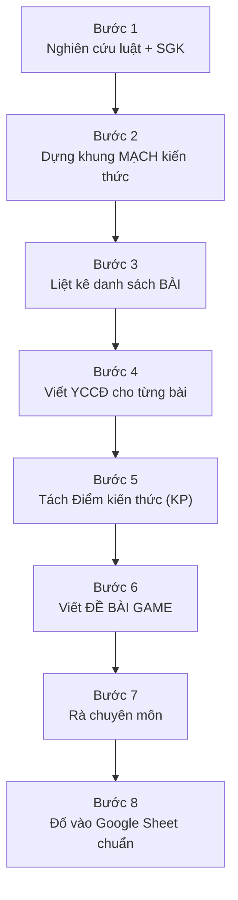

# 📚 HƯỚNG DẪN XÂY GIÁO TRÌNH + CẤU TRÚC BÀI HỌC + BÀI MẪU
## Dự án: Toán Tư Duy + Toán Tiếng Anh cho trẻ Mầm Non 3-6 tuổi

> **Đây là file QUAN TRỌNG NHẤT của bộ giao việc.** Đọc kỹ từ đầu đến cuối trước khi bắt tay soạn bài.
>
> **Dành cho:** Nhân viên MỚI, chưa có kinh nghiệm soạn giáo trình mầm non.
>
> **Mục tiêu sau khi đọc xong:** Bạn tự soạn được 1 bài học hoàn chỉnh, đúng chuẩn, đủ trường, viết được Yêu Cầu Cần Đạt đo được, và biết đề bài game phải mô tả thế nào để bên lập trình làm ra game đúng ý.
>
> **Phiên bản:** v1.0 · **Ngày:** 15-07-2026 · **Loại:** Documentation (Hướng dẫn giao việc)

---

## 📖 MỤC LỤC

1. [Giải thích nhanh vài từ hay gặp (đọc trước khỏi bỡ ngỡ)](#0)
2. [Phần 1 — 6 Nguyên tắc sư phạm nền tảng](#1)
3. [Phần 2 — Khung chương trình 3 tầng (Môn → Mạch → Bài)](#2)
4. [Phần 3 — Cấu trúc 1 bài học chuẩn (bảng các trường bắt buộc)](#3)
5. [Phần 4 — Cách viết Yêu Cầu Cần Đạt (YCCĐ) đúng](#4)
6. [Phần 5 — BÀI MẪU điền sẵn đầy đủ (4 bài)](#5)
7. [Phần 6 — Quy trình làm 1 Môn × Tuổi (8 bước)](#6)
8. [Phần 7 — 8 sai lầm hay gặp + cách tránh](#7)
9. [Phụ lục — Checklist tự kiểm trước khi nộp](#8)

---

<a name="0"></a>
## 🔤 GIẢI THÍCH NHANH VÀI TỪ HAY GẶP

Trước khi vào việc, hiểu mấy từ này để đọc tài liệu khỏi bỡ ngỡ:

| Từ | Nghĩa đơn giản |
|---|---|
| **Giáo trình** | Toàn bộ chương trình học 1 môn cho 1 độ tuổi (vd Toán tư duy cho trẻ 4-5 tuổi) — gồm nhiều bài học xếp theo thứ tự cả năm |
| **Bài học (Lesson)** | 1 đơn vị dạy 1 khái niệm (vd "Nhận biết to - nhỏ") — trong app là 1 chặng bé đi qua |
| **Điểm kiến thức (KP)** | Khái niệm nhỏ nhất mà bài dạy (vd "so sánh 2 vật to hơn / nhỏ hơn"). Một bài có 1-3 điểm kiến thức |
| **Rổ game** | Nhóm nhiều mini-game cùng dạy 1 điểm kiến thức, nhưng cách chơi khác nhau (khoanh, nối, tô màu, chọn đáp án...) |
| **YCCĐ** | Yêu Cầu Cần Đạt — sau khi học xong bé PHẢI làm được gì. Đây là thứ Bộ Giáo Dục quy định, ta bám theo |
| **VBHN 01/2021** | Văn Bản Hợp Nhất số 01/2021 của Bộ GD-ĐT — luật gốc quy định trẻ mầm non mỗi tuổi phải học gì, đạt gì. Đây là "hiến pháp" của giáo trình |
| **Bloom (Thang Bloom)** | Cách xếp mức độ tư duy từ dễ đến khó: Nhớ → Hiểu → Vận dụng → Phân tích. Trẻ mầm non chủ yếu ở 3 mức đầu |
| **CPA (Singapore)** | Cách dạy toán đi 3 bước: Cụ thể (đồ vật thật) → Hình ảnh (tranh) → Trừu tượng (con số). Xem chi tiết Phần 1 |
| **Xoắn ốc** | Học lại khái niệm cũ nhưng khó dần lên qua các độ tuổi (vd 3 tuổi đếm đến 5, 5 tuổi đếm đến 10) |
| **Song ngữ** | Học có cả tiếng Việt và tiếng Anh (áp dụng cho môn Toán Tiếng Anh) |
| **Mã bài (lesson_id)** | Số định danh của bài, kiểu `math_45_01`. Đặt 1 lần dùng mãi, KHÔNG đổi (xem Phần 3) |

> 📌 **Quy tắc vàng của toàn dự án:** Mọi thứ trong app IruKa đều là **học qua chơi**. Bé không "làm bài tập", bé "chơi game" và trong lúc chơi thì học được. Vì vậy mỗi bài học cuối cùng đều phải đẻ ra được **đề bài game** cho bên lập trình làm.

---

<a name="1"></a>
## 🌱 PHẦN 1 — 6 NGUYÊN TẮC SƯ PHẠM NỀN TẢNG

> Đây là 6 nguyên tắc "kim chỉ nam". Mọi bài bạn soạn phải soi lại 6 cái này. Nếu vi phạm 1 cái là bài chưa đạt.

### Nguyên tắc 1 — Lấy trẻ làm trung tâm

**Nghĩa là:** Thiết kế bài theo **bé học được gì**, KHÔNG phải theo **cô muốn dạy gì**. Bé 3-6 tuổi tập trung rất ngắn (3-5 phút/hoạt động), thích khám phá, thích được khen. Bài phải ngắn, vui, có phần thưởng.

**Áp dụng:** Mỗi game chỉ dạy 1 điểm kiến thức, chơi trong 1-3 phút. Không nhồi 5 khái niệm vào 1 game.

### Nguyên tắc 2 — Học qua chơi (chơi mà học, học bằng chơi)

**Nghĩa là:** Kiến thức phải giấu trong trò chơi. Bé tưởng đang chơi vui nhưng thật ra đang đếm, so sánh, phân loại.

**Ví dụ:** Thay vì hỏi khô khan "2 + 1 bằng mấy?", ta làm game "Giúp bạn Thỏ hái thêm 1 củ cà rốt bỏ vào giỏ đang có 2 củ — giỏ giờ có mấy củ?".

### Nguyên tắc 3 — Đi từ Cụ thể → Hình ảnh → Trừu tượng (phương pháp CPA / Singapore)

**Đây là nguyên tắc QUAN TRỌNG NHẤT của môn Toán.** CPA là viết tắt tiếng Anh của 3 bước:



| Bước | Tên | Trẻ làm gì | Ví dụ dạy số 3 |
|---|---|---|---|
| ① | **Cụ thể** | Cầm, sờ, di chuyển đồ vật thật | Bé cầm 3 viên sỏi, xếp thành hàng |
| ② | **Hình ảnh** | Nhìn tranh, đếm hình vẽ | Bé nhìn tranh 3 con vịt, đếm |
| ③ | **Trừu tượng** | Gắn với con số / ký hiệu | Bé nối tranh 3 con vịt với chữ số "3" |

> ⚠️ **Sai lầm chết người:** Nhảy thẳng vào bước ③ (dạy con số) mà bỏ bước ① và ②. Trẻ 3-4 tuổi CHƯA hiểu con số là trừu tượng — phải cho đếm đồ vật thật/hình vẽ trước rồi mới gắn số. Trong app: game cho tuổi nhỏ ưu tiên đồ vật/hình ảnh; game gắn con số dành cho tuổi lớn hơn.

### Nguyên tắc 4 — Vừa sức từng độ tuổi

**Nghĩa là:** Mỗi tuổi có "trần" riêng. Ép quá thì bé nản, dễ quá thì bé chán.

| Độ tuổi | Trần Toán (đại khái) | Đặc điểm |
|---|---|---|
| **3-4 tuổi** | Đếm 1-5, to/nhỏ, 1 vài hình cơ bản | Đếm vẹt nhiều hơn đếm hiểu, cầm nắm là chính |
| **4-5 tuổi** | Đếm 1-10, so sánh nhiều/ít, thêm/bớt trong 5 | Bắt đầu hiểu số, so sánh được |
| **5-6 tuổi** | Đếm 1-10 (có thể tới 20), tách/gộp, quy luật, chuẩn bị phép tính | Tư duy logic rõ, sẵn sàng vào lớp 1 |

### Nguyên tắc 5 — Lặp lại có nâng cao (Xoắn ốc)

**Nghĩa là:** Cùng 1 khái niệm được học lại ở tuổi sau nhưng khó hơn. Như đi cầu thang xoắn ốc: vòng lại điểm cũ nhưng cao hơn.

**Ví dụ khái niệm "Đếm":**
- 3-4 tuổi: đếm đến 5 bằng ngón tay
- 4-5 tuổi: đếm đến 10, biết số nào đứng trước/sau
- 5-6 tuổi: đếm đến 10-20, đếm cách quãng, đếm ngược

### Nguyên tắc 6 — Khen và động viên (không chê, không phạt)

**Nghĩa là:** Bé làm đúng → khen ngay ("Giỏi quá!"). Bé làm sai → KHÔNG báo "Sai rồi!" gắt gao, mà nhẹ nhàng "Thử lại nào, con làm được mà!". Trong app: âm thanh vui khi đúng, hiệu ứng nhẹ nhàng khi sai, luôn cho thử lại.

### 🇬🇧 Nguyên tắc riêng cho môn TOÁN TIẾNG ANH (song ngữ)

Ngoài 6 nguyên tắc trên, môn song ngữ có thêm 3 quy tắc:

| # | Quy tắc | Giải thích |
|---|---|---|
| A | **Nghe - hiểu TRƯỚC, nói - đọc SAU** | Cho bé nghe từ tiếng Anh nhiều lần (có phát âm chuẩn) trước khi bắt bé lặp lại. Giống cách trẻ học tiếng mẹ đẻ |
| B | **Từ vựng luôn GẮN HÌNH** | Từ "circle" phải đi kèm hình tròn. KHÔNG dạy từ tiếng Anh trơ trọi không hình. Bé nhớ qua hình, không qua chữ cái |
| C | **KHÔNG ép dịch Việt - Anh** | Không bắt bé "circle nghĩa là gì?". Cứ cho bé nghe "circle" + thấy hình tròn nhiều lần, tự bé nối được. Dịch ép làm bé rối |

> 💡 Trong game Toán Tiếng Anh: câu lệnh (Voice) đọc **song ngữ** — nói tiếng Việt để bé hiểu việc cần làm, chèn từ tiếng Anh vào đúng chỗ khái niệm. Xem bài mẫu Phần 5.

---

<a name="2"></a>
## 🏗️ PHẦN 2 — KHUNG CHƯƠNG TRÌNH 3 TẦNG

Giáo trình luôn tổ chức theo **3 tầng** từ to đến nhỏ:



### 2.1 TẦNG 1 — Có 2 MÔN

| Môn | Học bằng | Nội dung cốt lõi |
|---|---|---|
| **Toán Tư Duy** | Tiếng Việt | Số lượng, đếm, so sánh, phân loại, hình khối, không gian, quy luật, giải đố logic |
| **Toán Tiếng Anh** | Song ngữ (Việt + Anh) | Numbers, shapes, colors, size, more/less, phép cộng-trừ sơ khai bằng tiếng Anh, từ vựng toán |

> 🇬🇧 **QUAN TRỌNG — Toán Tiếng Anh là môn TĂNG CƯỜNG (ngoài chương trình bắt buộc):** Chương trình GDMN của Bộ (VBHN 01/2021) **KHÔNG có nội dung tiếng Anh**. Vì vậy khi ghi nguồn:
> - **Khái niệm toán** (đếm, so sánh, hình...) vẫn **bám VBHN** (lĩnh vực Nhận thức) — giống Toán tư duy.
> - **Phần tiếng Anh** bám khung riêng: **Thông tư 50/2020/TT-BGDĐT "Cho trẻ mẫu giáo làm quen với tiếng Anh"** (hoặc khung Cambridge Early Years). Nhân viên phải mở Thông tư này đối chiếu.
> - ❌ TUYỆT ĐỐI không ghi "VBHN bản song ngữ" — VBHN không có bản đó, ghi vậy là **gán nguồn sai** (mất uy tín cả bộ giáo trình).

### 2.2 TẦNG 2 — CÁC MẠCH KIẾN THỨC

#### 🧮 Các mạch của môn TOÁN TƯ DUY (9 mạch)

| # | Mạch kiến thức | Dạy cái gì | Ví dụ khái niệm |
|---|---|---|---|
| 1 | **Số lượng & Đếm** | Đếm đồ vật, nhận biết số lượng, số thứ tự | Đếm đến 5/10, "có mấy quả?", số 1-2-3 |
| 2 | **Nhận biết Mẫu / Quy luật (Pattern)** | Tìm quy luật lặp lại và tiếp nối | Đỏ-xanh-đỏ-xanh-... tiếp theo là gì? |
| 3 | **Phân loại & So sánh** | Xếp nhóm theo đặc điểm, so sánh nhiều/ít | Xếp riêng quả tròn / quả dài; nhóm nào nhiều hơn |
| 4 | **Tương ứng 1-1** | Mỗi vật ghép đúng 1 vật | Mỗi bạn thỏ 1 củ cà rốt — đủ hay thiếu? |
| 5 | **Hình khối** | Nhận biết & gọi tên hình | Tròn, vuông, tam giác, chữ nhật |
| 6 | **Không gian & Vị trí** | Định hướng trên/dưới, trước/sau, trái/phải | Con mèo ở TRÊN hay DƯỚI bàn? |
| 7 | **Đo lường sơ khai** | So sánh kích thước, độ dài, cao thấp | Cây nào cao hơn? Băng giấy nào dài hơn? |
| 8 | **Giải đố Logic** | Suy luận đơn giản, tìm cái thiếu/khác | Hình nào không cùng nhóm? Điền hình còn thiếu |
| 9 | **Định hướng thời gian** | Nhận biết trình tự & mốc thời gian | Sáng/trưa/tối; hôm qua/hôm nay/mai; thứ tự sự việc |

#### 🇬🇧 Các mạch của môn TOÁN TIẾNG ANH (7 mạch)

| # | Mạch kiến thức | Dạy cái gì | Từ vựng lõi |
|---|---|---|---|
| 1 | **Numbers 1-10 / 1-20** | Đếm & nhận số bằng tiếng Anh | one, two... ten (twenty) |
| 2 | **Shapes** | Gọi tên hình bằng tiếng Anh | circle, square, triangle, rectangle, star |
| 3 | **Colors + Size** | Màu sắc & kích thước | red, blue, yellow; big, small |
| 4 | **Comparison (more/less, big/small)** | So sánh bằng tiếng Anh | more, less, bigger, smaller, same |
| 5 | **Phép cộng - trừ sơ khai (Add/Subtract)** | Thêm/bớt bằng tiếng Anh (chỉ tuổi lớn) | add, plus, take away, how many |
| 6 | **Từ vựng Toán (Math words)** | Từ chỉ số lượng, vị trí | count, first, last, up, down |
| 7 | **Positions (in/on/under)** | Vị trí bằng tiếng Anh | in, on, under, next to |

### 2.3 GỢI Ý PHÂN BỔ THEO 3 ĐỘ TUỔI — Cái gì dạy tuổi nào

> Bảng này giúp bạn biết khi soạn 1 mạch thì tuổi nào học đến đâu. Cột đánh dấu ✅ = dạy chính, 🔁 = ôn lại nâng cao, ➖ = chưa dạy.

#### Toán Tư Duy

| Mạch | 3-4 tuổi | 4-5 tuổi | 5-6 tuổi |
|---|---|---|---|
| Số lượng & Đếm | ✅ đếm 1-5 | 🔁 đếm 1-10, số thứ tự | 🔁 1-10 (đến 20 là *tăng cường*), tách-gộp |
| Quy luật (Pattern) | ➖ | ✅ quy luật 2 yếu tố (AB) | 🔁 quy luật 3 yếu tố (ABC) |
| Phân loại & So sánh | ✅ theo 1 dấu hiệu (màu) | 🔁 theo 2 dấu hiệu | 🔁 nhiều/ít, bằng nhau |
| Tương ứng 1-1 | ✅ ghép đôi đơn giản | 🔁 đủ/thiếu | 🔁 gắn số lượng |
| Hình khối | ✅ tròn, vuông | 🔁 + tam giác | 🔁 + chữ nhật, hình thực tế |
| Không gian & Vị trí | ✅ trên-dưới | 🔁 trước-sau | 🔁 trái-phải |
| Đo lường sơ khai | ✅ to-nhỏ | 🔁 dài-ngắn, cao-thấp | 🔁 rộng-hẹp, đo bằng bước chân |
| Giải đố Logic | ➖ | ✅ tìm cái khác | 🔁 tìm cái thiếu, suy luận |
| Định hướng thời gian | ✅ sáng-tối | 🔁 hôm qua/hôm nay/mai | 🔁 thứ trong tuần, trình tự sự việc |

#### Toán Tiếng Anh

| Mạch | 3-4 tuổi | 4-5 tuổi | 5-6 tuổi |
|---|---|---|---|
| Numbers | ✅ 1-5 | 🔁 1-10 | 🔁 1-10 (tới 20) |
| Shapes | ✅ circle, square | 🔁 + triangle | 🔁 + rectangle, star |
| Colors + Size | ✅ 3 màu, big/small | 🔁 + more màu | 🔁 kết hợp màu + size |
| Comparison | ➖ | ✅ more/less | 🔁 bigger/smaller/same |
| Add / Subtract | ➖ | ➖ | ✅ cộng-trừ trong 5 |
| Math words | ✅ count, up/down | 🔁 first/last | 🔁 + how many |
| Positions | ➖ | ✅ in/on | 🔁 + under, next to |

> 📌 **Nguyên tắc xoắn ốc thể hiện ở đây:** cùng 1 mạch, tuổi sau học lại nhưng nâng cao (dấu 🔁). Đừng dạy trẻ 3-4 tuổi thứ đánh dấu ➖ — chưa vừa sức.

### 2.4 BẢN ĐỒ TIÊN QUYẾT — mạch nào phải học TRƯỚC

> Không chỉ "dễ → khó" trong 1 mạch, mà giữa các mạch cũng có thứ tự. Học A trước mới làm được B.



**Đọc sơ đồ:** Đếm + Tương ứng 1-1 là nền → mới tới So sánh/Phân loại → mới tới Đo lường & Quy luật → cao nhất là Giải đố Logic. Hình khối, Không gian, Thời gian học song song, không phụ thuộc mạch khác.

---

<a name="3"></a>
## 📋 PHẦN 3 — CẤU TRÚC 1 BÀI HỌC CHUẨN

> Đây là "form mẫu" của 1 bài học. Mỗi bài bạn soạn PHẢI điền đủ các trường dưới đây. Đây cũng là các cột khi đổ vào Google Sheet chuẩn.

### 3.1 Bảng các trường bắt buộc

| # | Trường | Bắt buộc? | Giải thích | Ví dụ |
|---|---|---|---|---|
| 1 | **Mã bài (lesson_id)** | ✅ | Số định danh bài, đặt 1 lần dùng mãi. Quy ước: `<môn>_<tuổi>_<số thứ tự>`. **KHÔNG BAO GIỜ đổi mã này** dù có xếp lại thứ tự bài | `math_34_05` (Toán tư duy, 3-4 tuổi, bài 5) |
| 2 | **Môn** | ✅ | Toán Tư Duy hoặc Toán Tiếng Anh | Toán Tư Duy |
| 3 | **Độ tuổi** | ✅ | 3-4 / 4-5 / 5-6 | 3-4 tuổi |
| 4 | **Tên bài** | ✅ | Tên gọi bài, ngắn gọn, dễ hiểu, bắt đầu bằng động từ hành vi | Nhận biết to - nhỏ |
| 5 | **Mạch / Chủ đề** | ✅ | Thuộc mạch kiến thức nào (Phần 2) | Đo lường sơ khai |
| 6 | **Yêu cầu cần đạt (YCCĐ)** | ✅ | Học xong bé làm được gì. Bám VBHN. Xem Phần 4 cách viết | Trẻ nhận ra và nói được vật nào to hơn, vật nào nhỏ hơn khi so sánh 2 vật |
| 7 | **Kỹ năng** | ✅ | Kỹ năng chính bé rèn (quan sát, so sánh, đếm, phân loại...) | Quan sát, so sánh |
| 8 | **Độ khó** | ✅ | 3 mức: **Làm quen** (mới gặp) / **Củng cố** (đã học, luyện thêm) / **Nâng cao** (mở rộng khó hơn) | Làm quen |
| 9 | **Từ vựng** | ⚠️ chỉ Toán Tiếng Anh | Danh sách từ tiếng Anh bài dạy, kèm nghĩa + hình gợi ý | big (to), small (nhỏ) |
| 10 | **Đề bài / Hoạt động game** | ✅ | Mô tả game cho bên lập trình. Phải có: Voice text (lời đọc), Vật thể cần vẽ, Câu hỏi hiển thị, Cách chơi, Điều kiện đúng/sai. Xem Phần 5 | (xem bài mẫu) |
| 11 | **Nguồn tham khảo** | ✅ | Ghi **nguyên văn** câu yêu cầu cần đạt trong luật + số mục/trang (KHÔNG paraphrase, KHÔNG bịa tên mục). Toán tư duy → VBHN; Toán tiếng Anh → xem ghi chú "tăng cường" ở Phần 2.1 | VBHN 01/2021, lĩnh vực Nhận thức, trích nguyên văn: "So sánh kích thước 2 đối tượng" (tuổi 3-4) |
| 12 | **Lĩnh vực phát triển** | ✅ | Lĩnh vực GDMN bài chạm tới: chính + phụ (Nhận thức / Ngôn ngữ / Thể chất-vận động tinh / Tình cảm-KNXH / Thẩm mỹ) | Nhận thức (chính) + Vận động tinh (thao tác kéo-thả) |
| 13 | **Tiêu chí đạt (mastery)** | ✅ | Ngưỡng coi như bé "đã nắm" — để **AI biết khi nào cho qua bài / nâng độ khó** | Chọn đúng ≥ 4/5 lượt, trong 2 lần chơi liên tiếp |

### 3.2 Giải thích kỹ 3 trường dễ làm sai

**Trường "Mã bài" — tại sao KHÔNG được đổi:**
Mã bài được bên lập trình gắn vào cơ sở dữ liệu (kho dữ liệu của app). Nếu bạn xếp lại thứ tự bài rồi đổi luôn mã → app không tìm thấy bài → hỏng. Quy tắc: **xếp lại thứ tự thì đổi Số Thứ Tự (STT) hiển thị, GIỮ NGUYÊN mã bài.** (Đây là quy tắc "Mã bất biến, Tên đổi được" — mã để máy dùng, tên để người đọc.)

**Trường "Độ khó" — 3 mức nghĩa là gì:**
| Mức | Khi nào dùng | Ví dụ |
|---|---|---|
| **Làm quen** | Bé lần đầu gặp khái niệm | Lần đầu học "to - nhỏ" |
| **Củng cố** | Đã học rồi, chơi thêm cho nhớ | Chơi thêm game to-nhỏ với đồ vật khác |
| **Nâng cao** | Mở rộng khó hơn hoặc thêm thử thách | So sánh 3 vật: to nhất - vừa - nhỏ nhất |

**Trường "Đề bài / Hoạt động game" — trường KHÓ NHẤT:**
Đây là trường bên lập trình đọc để làm ra game. Phải mô tả cụ thể đến mức người khác đọc là làm được ngay, gồm 5 phần nhỏ:
1. **Voice text** — lời đọc phát ra loa (cái bé nghe). Viết đúng như bé sẽ nghe.
2. **Vật thể cần vẽ** — liệt kê hình ảnh cần có trên màn hình.
3. **Câu hỏi hiển thị** — chữ hiện trên màn (nếu có — tuổi nhỏ thường không cần chữ).
4. **Cách chơi** — bé bấm/kéo/thả gì để trả lời.
5. **Điều kiện đúng / sai** — chọn cái nào là đúng, phản hồi ra sao.

---

<a name="4"></a>
## ✍️ PHẦN 4 — CÁCH VIẾT YÊU CẦU CẦN ĐẠT (YCCĐ) ĐÚNG

> YCCĐ là trái tim của bài. Viết sai YCCĐ thì cả bài lệch. Đây là lỗi nhân viên mới hay mắc nhất.

### 4.1 Nguyên tắc: DÙNG ĐỘNG TỪ ĐO ĐƯỢC

YCCĐ phải bắt đầu bằng động từ mà **nhìn vào là biết bé làm được hay chưa**. Bám Thang Bloom (từ dễ đến khó):

| Mức Bloom | Động từ nên dùng | Ví dụ YCCĐ |
|---|---|---|
| **Nhớ** | nhận biết, chỉ ra, gọi tên, đếm | "Trẻ **đếm** được đến 5 các đồ vật" |
| **Hiểu** | so sánh, phân biệt, sắp xếp | "Trẻ **so sánh** được 2 vật to hơn / nhỏ hơn" |
| **Vận dụng** | phân loại, ghép, tạo ra, tiếp nối | "Trẻ **tiếp nối** được quy luật màu sắc đơn giản" |

### 4.2 So sánh CÂU SAI vs CÂU ĐÚNG

| ❌ Câu SAI (chung chung, không đo được) | ✅ Câu ĐÚNG (đo được, có tuổi) |
|---|---|
| "Trẻ hiểu về số lượng" | "Trẻ đếm được đến 5 và nói đúng số lượng nhóm đồ vật (tuổi 3-4)" |
| "Trẻ biết về hình học" | "Trẻ nhận biết và gọi tên được hình tròn, hình vuông (tuổi 3-4)" |
| "Trẻ nắm được to nhỏ" | "Trẻ so sánh và chỉ ra được vật to hơn, vật nhỏ hơn khi nhìn 2 vật (tuổi 3-4)" |
| "Trẻ làm quen phép cộng" | "Trẻ thêm 1 đối tượng vào nhóm có sẵn và đếm ra tổng trong phạm vi 5 (tuổi 5-6)" |

> **Vì sao câu SAI là sai?** Từ "hiểu", "biết", "nắm được" — bạn không nhìn thấy được. Bé "hiểu số lượng" là hiểu đến đâu? Đếm được mấy? Còn "đếm được đến 5" thì đưa 5 quả cho bé đếm là biết ngay đạt hay chưa.

### 4.3 Công thức viết YCCĐ

```
[Động từ đo được] + [nội dung cụ thể] + [phạm vi/giới hạn] + [gắn độ tuổi]
```

**Ví dụ ráp công thức:**
- Động từ: "nhận biết và gọi tên"
- Nội dung: "hình tròn, hình vuông, hình tam giác"
- Phạm vi: "trong tranh và đồ vật thực tế"
- Tuổi: "(4-5 tuổi)"
- → **"Trẻ nhận biết và gọi tên được hình tròn, hình vuông, hình tam giác trong tranh và đồ vật thực tế (4-5 tuổi)."**

### 4.4 Với môn TOÁN TIẾNG ANH — thêm 1 lớp ngôn ngữ

YCCĐ song ngữ tách rõ **nghe-hiểu** và **nói**:

| ✅ Đúng | Giải thích |
|---|---|
| "Trẻ nghe và chỉ đúng hình khi nghe từ tiếng Anh *circle, square* (4-5 tuổi)" | Ưu tiên NGHE-HIỂU trước |
| "Trẻ nói lại được từ *one, two, three* khi đếm 1-3 đồ vật (4-5 tuổi)" | NÓI đến sau, khi đã nghe quen |

> ⚠️ KHÔNG viết "Trẻ dịch được từ circle sang tiếng Việt" — vi phạm nguyên tắc "không ép dịch".

---

<a name="5"></a>
## 🎯 PHẦN 5 — BÀI MẪU ĐIỀN SẴN ĐẦY ĐỦ

> 4 bài mẫu dưới đây đã điền đủ 13 trường. Bạn dùng làm khuôn để soạn bài mới. Đọc kỹ phần "Đề bài game" — đó là cách mô tả game chuẩn.

---

### 🧮 BÀI MẪU 1 — Toán Tư Duy · Tuổi 3-4 · "Nhận biết to - nhỏ"

| Trường | Nội dung |
|---|---|
| **Mã bài** | `math_34_08` |
| **Môn** | Toán Tư Duy |
| **Độ tuổi** | 3-4 tuổi |
| **Tên bài** | Nhận biết to - nhỏ |
| **Mạch / Chủ đề** | Đo lường sơ khai |
| **YCCĐ** | Trẻ so sánh và chỉ ra được vật to hơn, vật nhỏ hơn khi nhìn 2 vật cùng loại (3-4 tuổi) |
| **Kỹ năng** | Quan sát, so sánh |
| **Độ khó** | Làm quen |
| **Từ vựng** | (không áp dụng — môn tiếng Việt) |
| **Nguồn tham khảo** | VBHN 01/2021, lĩnh vực Phát triển nhận thức, trích nguyên văn mục "So sánh kích thước 2 đối tượng" (tuổi 3-4) · Ghi chú GVMN: tuổi 3-4 so sánh trực quan, chỉ dùng 2 vật, chênh lệch rõ ràng |
| **Lĩnh vực phát triển** | Nhận thức (chính) + Vận động tinh (chạm chọn) |
| **Tiêu chí đạt** | Chọn đúng "quả to hơn" ≥ 4/5 lượt, trong 2 lần chơi liên tiếp |

**📱 Đề bài / Hoạt động game:**

```
TÊN GAME: Chọn quả bóng to
CƠ CHẾ: Chọn đáp án (bấm chọn 1 trong 2)
ĐỘ DÀI: ~1 phút

① VOICE TEXT (lời đọc phát ra loa):
   "Nhìn 2 quả bóng nào! Con hãy chạm vào quả bóng TO HƠN giúp bạn Gấu nhé!"

② VẬT THỂ CẦN VẼ:
   - 1 bạn Gấu dễ thương ở góc màn hình (nhân vật dẫn dắt)
   - 2 quả bóng cùng màu, cùng hình, khác kích thước rõ rệt:
     • Quả bóng TO (bên trái)
     • Quả bóng NHỎ (bên phải) — chỉ bằng khoảng 1/2 quả to
   - Nền sân chơi vui tươi

③ CÂU HỎI HIỂN THỊ:
   (Tuổi 3-4 chưa đọc chữ → KHÔNG hiện câu hỏi bằng chữ. Chỉ dùng Voice + icon tai nghe để bé bấm nghe lại)

④ CÁCH CHƠI:
   - Bé chạm (tap) vào 1 trong 2 quả bóng
   - Bé chọn quả TO → đúng
   - Bé chọn quả NHỎ → sai, cho thử lại

⑤ ĐIỀU KIỆN ĐÚNG / SAI:
   - ĐÚNG (chọn quả to): quả bóng nảy lên vui, có tiếng "Giỏi quá!", bạn Gấu vỗ tay, ngôi sao xuất hiện
   - SAI (chọn quả nhỏ): quả rung nhẹ, tiếng "Thử lại nào!", KHÔNG chuyển màn, cho chọn lại

BIẾN THỂ CÙNG ĐIỂM KIẾN THỨC (rổ game — cùng dạy "to-nhỏ", khác cách chơi):
   - Game "Kéo quả to vào giỏ lớn, quả nhỏ vào giỏ bé" (cơ chế kéo-thả)
   - Game "Khoanh tròn con vật to nhất" (cơ chế khoanh)
```

---

### 🧮 BÀI MẪU 2 — Toán Tư Duy · Tuổi 5-6 · "Nhận biết quy luật (Pattern)"

| Trường | Nội dung |
|---|---|
| **Mã bài** | `math_56_14` |
| **Môn** | Toán Tư Duy |
| **Độ tuổi** | 5-6 tuổi |
| **Tên bài** | Nhận biết và tiếp nối quy luật |
| **Mạch / Chủ đề** | Nhận biết Mẫu / Quy luật (Pattern) |
| **YCCĐ** | Trẻ nhận ra quy luật sắp xếp lặp lại (2-3 yếu tố) và chọn được đối tượng tiếp theo đúng quy luật (5-6 tuổi) |
| **Kỹ năng** | Quan sát, suy luận, dự đoán |
| **Độ khó** | Nâng cao |
| **Từ vựng** | (không áp dụng) |
| **Nguồn tham khảo** | VBHN 01/2021, lĩnh vực Phát triển nhận thức, trích nguyên văn mục "Nhận ra quy tắc sắp xếp và sao chép lại" (tuổi 5-6) · Ghi chú GVMN: bắt đầu quy luật 2 yếu tố (AB) rồi mới 3 yếu tố (ABC) |
| **Lĩnh vực phát triển** | Nhận thức (chính) + Vận động tinh (kéo-thả) |
| **Tiêu chí đạt** | Kéo đúng toa tiếp theo ≥ 4/5 lượt, qua được cả quy luật AB và ABC |

**📱 Đề bài / Hoạt động game:**

```
TÊN GAME: Đoàn tàu tiếp theo
CƠ CHẾ: Kéo-thả chọn hình còn thiếu
ĐỘ DÀI: ~2 phút

① VOICE TEXT:
   "Đoàn tàu đang chạy theo một quy luật đấy! Con nhìn xem: đỏ - xanh - đỏ - xanh...
    Toa tiếp theo sẽ màu gì? Kéo đúng toa tàu bỏ vào chỗ trống giúp bác lái tàu nhé!"

② VẬT THỂ CẦN VẼ:
   - 1 đoàn tàu ngang màn hình, các toa xếp theo quy luật: [đỏ][xanh][đỏ][xanh][ ? ]
   - Ô trống nhấp nháy ở cuối đoàn tàu (chỗ cần điền)
   - 3 toa tàu rời phía dưới để bé chọn kéo lên: 1 toa đỏ, 1 toa xanh, 1 toa vàng
   - Bác lái tàu vẫy tay (nhân vật dẫn dắt)

③ CÂU HỎI HIỂN THỊ:
   "Toa tàu tiếp theo màu gì?" (chữ to, có nút loa đọc lại)

④ CÁCH CHƠI:
   - Bé kéo (drag) 1 trong 3 toa dưới lên thả vào ô trống
   - Kéo đúng toa xanh → đúng (vì quy luật đỏ-xanh, sau đỏ là xanh)
   - Kéo toa đỏ hoặc vàng → sai, toa tự trượt về, cho kéo lại

⑤ ĐIỀU KIỆN ĐÚNG / SAI:
   - ĐÚNG (toa xanh): đoàn tàu chạy đi "tu tu!", tiếng vỗ tay, "Chính xác! Con giỏi lắm!", +1 ngôi sao
   - SAI: toa trượt về chỗ cũ, tiếng "Ơ, chưa đúng rồi, nhìn lại quy luật xem!", cho thử lại

NÂNG CẤP THEO ĐỘ KHÓ (trong cùng bài):
   - Vòng 1: quy luật 2 yếu tố AB (đỏ-xanh)
   - Vòng 2: quy luật 3 yếu tố ABC (đỏ-xanh-vàng)
   - Vòng 3: quy luật hình dạng (tròn-vuông-tròn-vuông)

BIẾN THỂ CÙNG ĐIỂM KIẾN THỨC:
   - Game "Chuỗi hạt vòng cổ" — xâu hạt tiếp theo quy luật
   - Game "Vườn hoa" — trồng hoa tiếp theo quy luật màu
```

---

### 🇬🇧 BÀI MẪU 3 — Toán Tiếng Anh · Tuổi 4-5 · "Numbers 1-5 / Count objects"

| Trường | Nội dung |
|---|---|
| **Mã bài** | `matheng_45_03` |
| **Môn** | Toán Tiếng Anh |
| **Độ tuổi** | 4-5 tuổi |
| **Tên bài** | Numbers 1-5 — Đếm đồ vật bằng tiếng Anh |
| **Mạch / Chủ đề** | Numbers 1-10 (phạm vi 1-5 cho tuổi này) |
| **YCCĐ** | Trẻ nghe và đếm được đồ vật từ 1 đến 5, nói lại được số đếm tiếng Anh *one, two, three, four, five* khi đếm (4-5 tuổi) |
| **Kỹ năng** | Đếm, nghe - nói tiếng Anh, tương ứng 1-1 |
| **Độ khó** | Làm quen |
| **Từ vựng** | **one** (một), **two** (hai), **three** (ba), **four** (bốn), **five** (năm) — mỗi từ gắn hình số lượng tương ứng (1 quả táo, 2 quả táo...) |
| **Nguồn tham khảo** | KHÁI NIỆM đếm: VBHN 01/2021, lĩnh vực Nhận thức, "Đếm trong phạm vi 10" (tuổi 4-5). PHẦN TIẾNG ANH (**tăng cường**): Thông tư 50/2020/TT-BGDĐT — chủ đề Numbers 1-5 · Nguyên tắc song ngữ: nghe-hiểu trước, từ gắn hình |
| **Lĩnh vực phát triển** | Nhận thức (chính) + Ngôn ngữ (nghe-nói tiếng Anh) + Vận động tinh |
| **Tiêu chí đạt** | Đếm & chọn đúng số ≥ 4/5 lượt; nói lại được one–five khi đếm |

**📱 Đề bài / Hoạt động game:**

```
TÊN GAME: Count the apples! (Đếm táo nào!)
CƠ CHẾ: Đếm & chọn số đúng
ĐỘ DÀI: ~2 phút

① VOICE TEXT (SONG NGỮ — tiếng Việt dẫn dắt, chèn từ tiếng Anh):
   "Cây táo có mấy quả nhỉ? Con đếm cùng cô bằng tiếng Anh nhé:
    one... two... three! (chạm từng quả, mỗi quả sáng lên khi đọc)
    Có 3 quả táo — three apples! Con chọn số THREE giúp bạn Sóc nào!"

② VẬT THỂ CẦN VẼ:
   - 1 cây táo có 3 quả táo đỏ (số lượng thay đổi mỗi vòng: 1-5 quả)
   - Bạn Sóc cầm giỏ (nhân vật)
   - 3 thẻ số để chọn, mỗi thẻ ghi chữ số + chữ tiếng Anh:
     • Thẻ "2 — two"   • Thẻ "3 — three"   • Thẻ "4 — four"

③ CÂU HỎI HIỂN THỊ:
   "How many apples?" (kèm nút loa đọc)

④ CÁCH CHƠI:
   - Bé chạm từng quả táo để đếm (mỗi lần chạm phát âm "one, two, three")
   - Sau đó bé chạm thẻ số đúng (thẻ "3 — three")

⑤ ĐIỀU KIỆN ĐÚNG / SAI:
   - ĐÚNG (chọn three): táo rơi vào giỏ Sóc, tiếng "Yes! Three apples! Well done!",
     +1 ngôi sao, phát lại từ "three" 1 lần cho bé nhớ
   - SAI: thẻ rung nhẹ, tiếng "Let's count again! one... two... three...", đếm lại rồi cho chọn

LƯU Ý SONG NGỮ:
   - Phát âm tiếng Anh phải CHUẨN (thu âm người bản xứ hoặc giọng đọc chuẩn)
   - Từ tiếng Anh luôn đi kèm số lượng thật (3 quả = three) → bé nối nghĩa qua hình
   - KHÔNG bắt bé dịch "three là gì" — cứ nghe + thấy nhiều lần

BIẾN THỂ CÙNG ĐIỂM KIẾN THỨC:
   - Game "Feed the animals" — cho đúng số miếng thức ăn (đếm 1-5 tiếng Anh)
   - Game "Number balloons" — chạm bóng bay có số đúng khi nghe "four"
```

---

### 🇬🇧 BÀI MẪU 4 — Toán Tiếng Anh · Tuổi 5-6 · "Big and Small / Compare"

| Trường | Nội dung |
|---|---|
| **Mã bài** | `matheng_56_07` |
| **Môn** | Toán Tiếng Anh |
| **Độ tuổi** | 5-6 tuổi |
| **Tên bài** | Big and Small — So sánh kích thước bằng tiếng Anh |
| **Mạch / Chủ đề** | Comparison (more/less, big/small) |
| **YCCĐ** | Trẻ nghe và chọn đúng vật *big / small*, nói lại được *bigger / smaller* khi so sánh 2 vật (5-6 tuổi) |
| **Kỹ năng** | So sánh, nghe - nói tiếng Anh |
| **Độ khó** | Củng cố |
| **Từ vựng** | **big** (to), **small** (nhỏ), **bigger** (to hơn), **smaller** (nhỏ hơn), **same** (bằng nhau) — gắn hình cặp vật to/nhỏ |
| **Nguồn tham khảo** | KHÁI NIỆM so sánh: VBHN 01/2021, lĩnh vực Nhận thức, "So sánh kích thước" (tuổi 5-6). PHẦN TIẾNG ANH (**tăng cường**): Thông tư 50/2020/TT-BGDĐT — chủ đề Size/Comparison · Nguyên tắc: khái niệm to-nhỏ đã học tiếng Việt (xoắn ốc), thêm lớp từ tiếng Anh |
| **Lĩnh vực phát triển** | Nhận thức (chính) + Ngôn ngữ (nghe-nói tiếng Anh) |
| **Tiêu chí đạt** | Chạm đúng vật theo lệnh big/small ≥ 4/5 lượt; nói lại bigger/smaller ở vòng nâng cao |

**📱 Đề bài / Hoạt động game:**

```
TÊN GAME: Big or Small? (To hay nhỏ?)
CƠ CHẾ: Nghe lệnh & chọn đúng vật
ĐỘ DÀI: ~2 phút

① VOICE TEXT (SONG NGỮ):
   "Con nhìn 2 chú voi nhé! Cô nói tiếng Anh, con chọn đúng nha:
    Touch the BIG elephant! (Chạm chú voi TO!)"
   (Vòng sau đổi lệnh: "Touch the SMALL one!" — chạm con nhỏ)

② VẬT THỂ CẦN VẼ:
   - 2 chú voi cùng màu, khác kích thước rõ: 1 voi BIG (to), 1 voi SMALL (nhỏ)
   - Nhãn chữ dưới mỗi con: "big" và "small" (chữ tiếng Anh, có màu nổi bật)
   - Bạn dẫn dắt: chú Khỉ

③ CÂU HỎI HIỂN THỊ:
   "Touch the BIG elephant" (từ khoá big/small in đậm màu, đổi theo vòng, có nút loa)

④ CÁCH CHƠI:
   - Bé nghe lệnh tiếng Anh (big hoặc small)
   - Bé chạm đúng chú voi theo lệnh
   - Vòng nâng cao: hỏi "Which one is BIGGER?" (con nào to hơn) — bé so sánh trực tiếp

⑤ ĐIỀU KIỆN ĐÚNG / SAI:
   - ĐÚNG: voi được chọn kêu "pu prừn!" vui, tiếng "Yes! That's the big one! Great job!",
     phát lại từ khoá (big/small) cho bé nhớ, +1 ngôi sao
   - SAI: voi lắc đầu nhẹ, tiếng "Oops! Listen again: BIG means to. Try again!",
     đọc lại lệnh, cho chọn lại

NÂNG CẤP THEO ĐỘ KHÓ:
   - Vòng 1: big / small (chọn 1 trong 2)
   - Vòng 2: bigger / smaller (so sánh, dùng đuôi -er)
   - Vòng 3: same (2 vật bằng nhau — "They are the same!")

LƯU Ý SONG NGỮ:
   - Khái niệm to-nhỏ bé ĐÃ học bằng tiếng Việt từ tuổi 3-4 → giờ chỉ thêm lớp từ tiếng Anh
     (đây là xoắn ốc: khái niệm cũ + ngôn ngữ mới)
   - Nhấn mạnh nghe-hiểu: bé nghe "big" và chỉ đúng, chưa cần đọc chữ

BIẾN THỂ CÙNG ĐIỂM KIẾN THỨC:
   - Game "Sort by size" — kéo vật big vào rổ big, small vào rổ small
   - Game "Feed the big fish" — cho cá to ăn nhiều, cá nhỏ ăn ít
```

---

<a name="6"></a>
## 🛠️ PHẦN 6 — QUY TRÌNH LÀM 1 MÔN × TUỔI (8 BƯỚC)

> Khi được giao 1 môn cho 1 độ tuổi (vd "Toán tư duy 4-5 tuổi"), làm theo 8 bước này. Không nhảy bước.



| Bước | Tên | Làm gì cụ thể | Kết quả (output) |
|---|---|---|---|
| **1** | **Nghiên cứu** | Đọc VBHN 01/2021 phần môn × tuổi ("Nội dung giáo dục" + "Kết quả mong đợi"), **trích nguyên văn** (không paraphrase). **Riêng 5-6 tuổi:** đối chiếu thêm **Bộ chuẩn phát triển trẻ em 5 tuổi** (nhóm chỉ số Toán/Nhận thức) để đảm bảo sẵn sàng vào lớp 1. **Toán tiếng Anh:** đọc thêm **Thông tư 50/2020/TT-BGDĐT** (khung tiếng Anh mẫu giáo). Đọc SGK cùng độ tuổi để tham khảo | File ghi chú: danh sách YCCĐ (nguyên văn) + nguồn |
| **2** | **Dựng khung mạch** | Từ luật, liệt kê các MẠCH kiến thức áp dụng cho tuổi này (Phần 2.2). Sắp thứ tự mạch từ dễ → khó | Danh sách 5-8 mạch cho tuổi đó |
| **3** | **Liệt kê bài** | Mỗi mạch chia ra các BÀI. Đặt mã bài (`<môn>_<tuổi>_<stt>`). Đặt tên bài bằng động từ hành vi | Bảng N bài × {mã, tên, mạch} |
| **4** | **Viết YCCĐ** | Mỗi bài viết 1 YCCĐ đo được (Phần 4). Bám mã VBHN | Mỗi bài có 1 YCCĐ chuẩn |
| **5** | **Tách KP** | Mỗi bài tách 1-3 điểm kiến thức (khái niệm nhỏ nhất). KP là động từ hành vi, KHÔNG phải cách chơi | Mỗi bài có 1-3 KP |
| **6** | **Viết đề bài game** | Mỗi KP viết ít nhất 1 đề bài game đủ 5 phần (Voice, vật thể, câu hỏi, cách chơi, đúng/sai) | Rổ game cho mỗi KP |
| **7** | **Rà chuyên môn** | Soi lại 6 nguyên tắc sư phạm + vừa tuổi + đủ luật. Nhờ người có kinh nghiệm đọc lại (hoặc dùng workflow `/1-review-curriculum-mamnon`) | Bản đã sửa lỗi |
| **8** | **Đổ vào Sheet** | Điền vào Google Sheet chuẩn 11 cột (Phần 3.1). Áp format đẹp | Sheet giáo trình hoàn chỉnh |

> 💡 **Mẹo cho người mới:** Đừng làm cả môn 1 lúc. Làm XONG 1 mạch (vd "Số lượng & Đếm") → nhờ review → sửa → mới làm mạch tiếp. Làm nhỏ, chắc từng phần.

---

<a name="7"></a>
## 🪤 PHẦN 7 — 8 SAI LẦM HAY GẶP + CÁCH TRÁNH

> Đây là 8 lỗi nhân viên mới hay mắc nhất khi soạn giáo trình mầm non. Đọc kỹ để né.

| # | Sai lầm | Dấu hiệu nhận biết | Cách tránh |
|---|---|---|---|
| **1** | **Quá tải chữ** | Màn game đầy chữ, câu hỏi dài dòng | Trẻ 3-6 tuổi CHƯA đọc chữ (hoặc đọc chậm). Dùng VOICE (lời đọc) + hình ảnh. Câu hỏi hiển thị chỉ 3-5 từ, có nút loa |
| **2** | **YCCĐ chung chung không đo được** | Dùng từ "hiểu", "biết", "nắm được" | Dùng động từ đo được: đếm, chỉ ra, gọi tên, so sánh, phân loại (Phần 4) |
| **3** | **Không vừa tuổi** | Dạy trẻ 3-4 tuổi phép cộng, hoặc quy luật 3 yếu tố | Bám bảng phân bổ độ tuổi (Phần 2.3). Thứ đánh dấu ➖ = chưa dạy |
| **4** | **Chép sách vi phạm bản quyền** | Copy nguyên hình/đề bài từ SGK có bản quyền | SGK chỉ để THAM KHẢO nội dung. Tự thiết kế game riêng, nhân vật riêng của IruKa. KHÔNG copy hình/câu chữ nguyên si |
| **5** | **Thiếu truy nguồn** | Bài không ghi dựa vào mã VBHN nào | Mỗi bài PHẢI có trường "Nguồn tham khảo" ghi rõ mã VBHN. Để sau này kiểm tra được bài có đúng luật không |
| **6** | **Nhầm "cách chơi" thành "điểm kiến thức"** | Ghi KP là "Tô màu nhóm 2", "Khoanh tròn" | KP là KHÁI NIỆM (đếm, so sánh), KHÔNG phải cách chơi (tô, khoanh). Tô màu/khoanh chỉ là vỏ ngoài, ruột vẫn là "đếm" |
| **7** | **Đề bài game mô tả mơ hồ** | Chỉ ghi "game đếm số" mà không có Voice, vật thể, đúng/sai | Đề bài game PHẢI đủ 5 phần (Phần 3.2). Bên lập trình đọc là làm được ngay, không phải hỏi lại |
| **8** | **Đổi mã bài khi xếp lại thứ tự** | Sắp lại bài rồi đổi luôn mã `math_34_05` → `math_34_03` | GIỮ NGUYÊN mã bài, chỉ đổi Số Thứ Tự hiển thị. Đổi mã sẽ làm app hỏng (mã bất biến) |

### Bonus — 2 lỗi song ngữ riêng của Toán Tiếng Anh

| # | Sai lầm | Cách tránh |
|---|---|---|
| **9** | **Dạy từ tiếng Anh không gắn hình** | Mọi từ (circle, three, big) PHẢI đi kèm hình/số lượng thật. Bé nhớ qua hình |
| **10** | **Ép bé dịch Việt - Anh** | KHÔNG hỏi "circle là gì". Cho nghe + thấy nhiều lần, bé tự nối nghĩa. Nghe-hiểu trước, nói sau |

---

<a name="8"></a>
## ✅ PHỤ LỤC — CHECKLIST TỰ KIỂM TRƯỚC KHI NỘP

> In ra, soạn xong 1 bài thì tick từng mục. Đủ hết mới nộp.

**Về cấu trúc bài:**
- [ ] Đã điền đủ 13 trường (Phần 3.1)?
- [ ] Mã bài đúng quy ước `<môn>_<tuổi>_<stt>`?
- [ ] Tên bài bắt đầu bằng động từ hành vi?
- [ ] Có ghi **Lĩnh vực phát triển** (chính + phụ)?
- [ ] Có **Tiêu chí đạt (mastery)** đo được (vd ≥ 4/5 lượt)?
- [ ] (Toán tiếng Anh) Nguồn tách rõ: khái niệm → VBHN, tiếng Anh → Thông tư 50/2020 (KHÔNG ghi "VBHN bản song ngữ")?

**Về YCCĐ:**
- [ ] YCCĐ dùng động từ đo được (không "hiểu/biết/nắm")?
- [ ] YCCĐ có gắn độ tuổi cụ thể?
- [ ] Có ghi mã VBHN ở trường Nguồn tham khảo?

**Về điểm kiến thức (KP):**
- [ ] Mỗi bài có 1-3 KP?
- [ ] KP là khái niệm (không phải cách chơi tô/khoanh)?

**Về đề bài game:**
- [ ] Có đủ 5 phần: Voice, vật thể, câu hỏi, cách chơi, đúng/sai?
- [ ] Voice text viết đúng như bé sẽ nghe?
- [ ] Có phản hồi khen khi đúng, động viên khi sai?
- [ ] (Nếu song ngữ) Từ tiếng Anh gắn hình, Voice song ngữ?

**Về sư phạm:**
- [ ] Bài vừa sức độ tuổi (soi bảng Phần 2.3)?
- [ ] Có đi từ Cụ thể → Hình ảnh → Trừu tượng (không nhảy thẳng vào con số)?
- [ ] Không quá tải chữ (tuổi nhỏ dùng Voice + hình)?
- [ ] Không copy nguyên si từ SGK có bản quyền?

---

## 🔗 LIÊN KẾT & TÀI LIỆU KÈM

- File pattern gốc (kinh nghiệm thật IruKa): `.agent/memory/patterns/pattern_build_curriculum_mamnon_36_tuan.md`
- Workflow dựng giáo trình: `/1-build-curriculum-mamnon`
- Workflow phản biện (review như hiệu trưởng): `/1-review-curriculum-mamnon`
- Workflow làm Sheet đẹp: `/4-google-sheet-pro`
- Luật gốc: VBHN 01/2021-BGDĐT (Chương trình Giáo dục Mầm non)

---

*File: `04-huong-dan-xay-giao-trinh-va-bai-hoc.md` · Tạo 15-07-2026 · Dự án Toán Tư Duy + Toán Tiếng Anh mầm non 3-6 tuổi · Dành cho nhân viên mới. Bám pattern thực chiến IruKa (Toán 3-4 qua 12 vòng sửa).*
