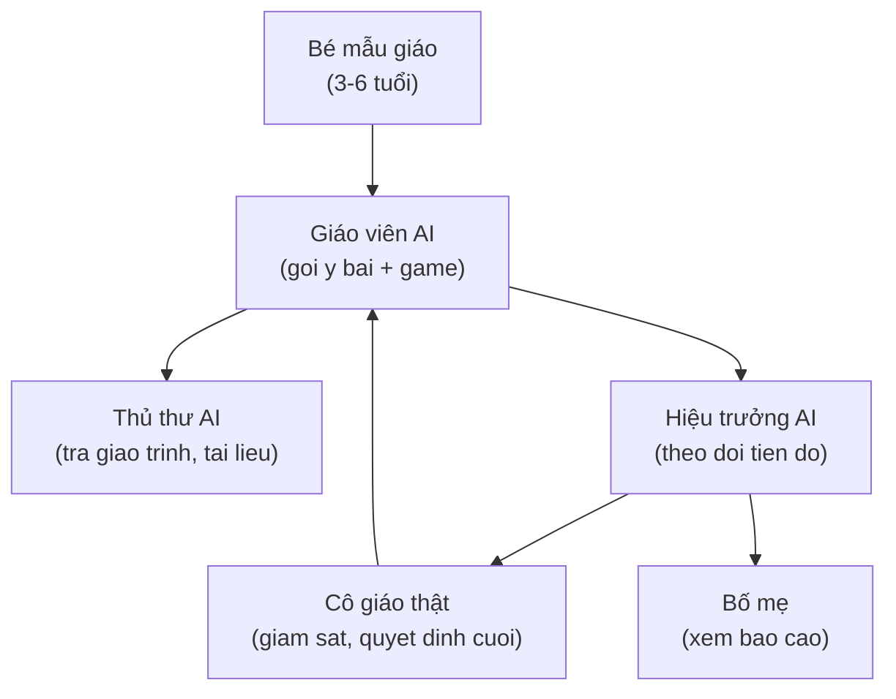
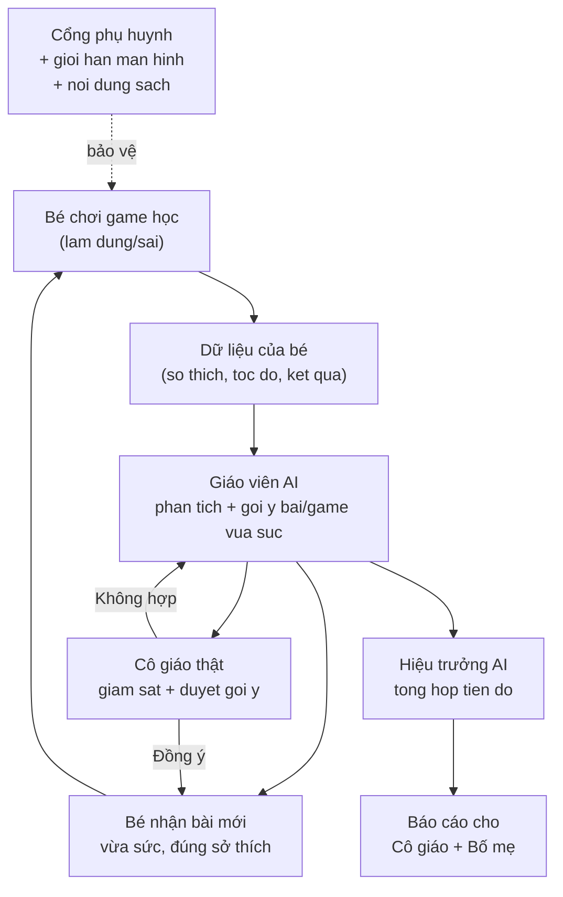

# 🤖 Định hướng ĐƯA AI XUỐNG DẠY Ở LỚP MẪU GIÁO

> **Ngày:** 15-07-2026
> **Repo:** dev-ops / task (bộ hồ sơ giao việc)
> **Loại:** Định hướng tầm nhìn (Vision) — giải thích vì sao giáo trình phải chuẩn bị sẵn cho AI
> **Dùng khi:** Người soạn giáo trình cần hiểu "sản phẩm mình soạn ra sẽ được AI dùng để làm gì" — để soạn cho ĐÚNG chuẩn.
> **Đọc kèm:** file `04` (xây giáo trình) + file `08` (nguồn lực).

---

## 1. Bức tranh lớn — AI làm gì ở lớp mẫu giáo?

IruKa không chỉ soạn giáo trình để in ra giấy. Đích cuối là: **đưa một "trợ giảng AI" (giáo viên phụ ảo — phần mềm thông minh biết gợi ý bài học) xuống tận lớp mẫu giáo**, giúp mỗi bé 3-6 tuổi học qua chơi theo đúng sức của mình.

> ⚠️ **Nguyên tắc số 1 — AI KHÔNG thay giáo viên.** AI chỉ **HỖ TRỢ**. Cô giáo vẫn là người ôm bé, dỗ bé khóc, quyết định bé hôm nay học gì. AI làm những việc lặp đi lặp lại và tính toán mà con người làm chậm: nhớ từng bé đã học tới đâu, gợi trò chơi tiếp theo, chấm nhanh đúng/sai, đọc đề bằng giọng nói cho bé chưa biết chữ.

**5 việc cụ thể AI làm ở lớp:**

| # | Việc AI làm | Giải thích cho dễ hình dung |
| --- | --- | --- |
| 1 | **Trợ giảng ảo** | Khi cô bận với 20 bé, AI ngồi cạnh 1 bé qua màn hình, dẫn bé chơi trò học Toán, nhắc nhẹ khi bé làm sai. |
| 2 | **Gợi ý bài / game theo sức từng bé** | Bé giỏi đếm rồi thì AI đưa trò khó hơn; bé còn lúng túng thì AI cho chơi lại trò dễ, không ép. |
| 3 | **Đọc đề bằng giọng nói** | Bé 3-4 tuổi chưa biết đọc chữ → AI đọc to đề bài, hỏi bé bằng giọng thân thiện. |
| 4 | **Khen — động viên** | Bé làm đúng → AI khen ("Giỏi quá!"), có tiếng vỗ tay, ngôi sao. Giữ bé vui, muốn học tiếp. |
| 5 | **Báo cáo tiến độ** | Cuối tuần AI tóm tắt cho cô giáo + bố mẹ: "Bé Na tuần này đếm tốt tới 10, còn yếu phân biệt to–nhỏ." |

---

## 2. Ba "vai AI" — bám đúng hệ IruKa đang có

IruKa thiết kế AI thành **3 vai riêng biệt** (giống 3 người trong một trường học), mỗi vai một việc, không lẫn lộn:

| Vai AI | Việc chính | Ví dụ 1 câu |
| --- | --- | --- |
| **Giáo viên AI** | Gợi ý bé nên học bài nào, chơi game nào tiếp theo | "Bé Bo học xong đếm tới 5, gợi ý trò 'Hái táo đếm số' tiếp theo." |
| **Thủ thư AI** | Tra cứu giáo trình + kho tài liệu để trả lời "bài này thuộc phần nào, có tài liệu gì" | "Bài 'To và nhỏ' thuộc mạch So sánh, lĩnh vực Nhận thức, có 3 game kèm." |
| **Hiệu trưởng AI** | Nhìn tổng thể, theo dõi tiến độ, báo cáo cho cô giáo + bố mẹ | "Lớp Mầm tuần này 80% bé đạt mục tiêu đếm tới 5." |

> 📌 **Vì sao chia 3 vai?** Để mỗi vai làm tốt 1 việc, không "ôm đồm". Giống trường học thật: giáo viên dạy, thủ thư giữ sách, hiệu trưởng quản lý. Chia rõ thì dễ kiểm soát, dễ sửa khi sai.

---

## 3. AI cá nhân hoá — "may đo" cho từng bé

Điểm mạnh nhất của AI là **không dạy tất cả các bé giống nhau**. Mỗi bé một tính, một tốc độ, một sở thích. AI dựa vào **dữ liệu thật của bé** (những gì bé đã làm trong app) để "may đo" bài học vừa vặn:

| AI nhìn vào gì? | Rồi AI làm gì? |
| --- | --- |
| Bé làm **đúng / sai** nhiều hay ít | Sai nhiều → cho chơi lại trò dễ hơn, chậm hơn. Đúng đều → nâng độ khó. |
| Bé **thích chủ đề gì** (con vật, xe cộ, hoa quả…) | Ưu tiên game có chủ đề bé thích → bé hào hứng hơn. |
| Bé làm **nhanh hay chậm** | Chậm → giảm số câu, tăng thời gian. Nhanh → thêm thử thách. |
| Bé **học liên tục hay hay nghỉ** | Nghỉ lâu → gợi ôn lại bài cũ trước khi học bài mới. |

**Nguyên tắc "vừa sức" (không quá dễ, không quá khó):** Bài quá dễ → bé chán. Bài quá khó → bé nản, khóc. AI luôn cố giữ bé ở "vùng vừa tầm với" — cố một chút là làm được → bé thấy vui vì mình giỏi lên.

> 🎯 **Đây chính là lý do giáo trình phải soạn chuẩn** (xem mục 5). AI chỉ "may đo" được nếu mỗi bài học có gắn sẵn nhãn: độ khó bao nhiêu, rèn kỹ năng gì, hợp độ tuổi nào.

---

## 4. AN TOÀN TRẺ EM — điều KHÔNG được phép sai

Đây là phần **quan trọng nhất và không thoả hiệp**. Trẻ 3-6 tuổi rất non nớt, bố mẹ rất lo. Mọi thiết kế AI phải đặt an toàn của bé lên trước hết.

| Quy tắc an toàn | Nghĩa là gì |
| --- | --- |
| **Nội dung sạch 100%** | Không có gì bạo lực, đáng sợ, quảng cáo, hay không hợp lứa tuổi. Mọi hình ảnh/âm thanh phải dễ thương, an lành. |
| **Không thu thập dữ liệu nhạy cảm quá mức** | Chỉ giữ những gì cần để dạy (bé học tới đâu). KHÔNG lấy thừa thông tin riêng tư của bé/gia đình. |
| **Có "cổng phụ huynh"** | Muốn vào phần cài đặt / xem dữ liệu con → phải qua một bước chặn dành cho người lớn (ví dụ câu hỏi mà bé nhỏ chưa trả lời được). Chống bé tự bấm lung tung. |
| **Giới hạn thời gian nhìn màn hình** | Bé mẫu giáo KHÔNG nên nhìn màn hình lâu. AI phải tự nhắc nghỉ, tự dừng sau một khoảng thời gian ngắn. Bảo vệ mắt và giấc ngủ của bé. |
| **Cô giáo là người quyết định cuối** | AI chỉ *gợi ý*. Cô giáo có quyền bỏ qua, đổi, hoặc dừng bất cứ lúc nào. Máy không được "tự quyết" thay người. |

> 🛡️ Ghi nhớ: Bố mẹ tin tưởng giao con cho IruKa. Chỉ cần một lần lộ dữ liệu con hay một nội dung không sạch lọt qua là mất niềm tin mãi mãi. **An toàn trẻ em = ranh giới đỏ, không bao giờ được vượt.**

---

## 5. Vai trò của DỰ ÁN NÀY — soạn giáo trình để AI "dùng được"

Đây là điểm nối quan trọng giữa file này và công việc soạn giáo trình của bạn.

**AI thông minh tới đâu cũng vô dụng nếu giáo trình soạn cẩu thả.** Muốn AI gợi ý đúng bài, đúng game, đúng sức bé — thì **mỗi bài học trong giáo trình phải được "dán nhãn" rõ ràng ngay từ khâu soạn.**

Mỗi bài học BẮT BUỘC ghi rõ 4 thứ (để AI đọc được):

| Nhãn cần gắn | Vì sao AI cần | Ví dụ |
| --- | --- | --- |
| **YCCĐ** (Yêu cầu cần đạt — bé học xong phải làm được gì) | Để AI biết bé "đạt" hay "chưa đạt" | "Đếm được các vật trong phạm vi 5." |
| **Độ khó** | Để AI xếp bài dễ → khó đúng thứ tự, không nhảy cóc | Dễ / Vừa / Khó |
| **Kỹ năng rèn** | Để AI gợi bài rèn đúng thứ bé còn yếu | "Đếm số", "So sánh to–nhỏ" |
| **Lĩnh vực phát triển** | Để AI cân đối cho bé phát triển toàn diện | "Nhận thức", "Ngôn ngữ"… |

> ✅ **Tóm 1 câu:** Bạn soạn giáo trình càng chuẩn — gắn nhãn càng đầy đủ, rõ ràng — thì AI càng gợi ý đúng cho bé. Giáo trình lỏng lẻo, thiếu nhãn → AI "mù", gợi ý bừa. **Chất lượng AI phụ thuộc vào chất lượng giáo trình bạn soạn hôm nay.**

---

## 6. Rủi ro & cách phòng

Làm gì cũng có rủi ro. Dưới đây là 3 rủi ro lớn nhất và cách IruKa phòng trước:

| Rủi ro | Điều xấu có thể xảy ra | Cách phòng |
| --- | --- | --- |
| **AI gợi ý sai** | AI đưa bài quá khó/quá dễ, hoặc game không hợp lứa tuổi | (1) Giáo trình gắn nhãn chuẩn (mục 5). (2) Cô giáo luôn duyệt lại, có quyền bỏ gợi ý. (3) Thử nghiệm kỹ trước khi dùng thật. |
| **Quá tải màn hình** | Bé nhìn màn hình lâu → mỏi mắt, cáu gắt, nghiện | (1) AI tự đặt giới hạn thời gian ngắn. (2) Xen kẽ hoạt động ngoài màn hình (vận động, vẽ tay). (3) Cổng phụ huynh cho bố mẹ đặt giờ. |
| **Phụ huynh lo lắng** | Bố mẹ sợ con bị hại, sợ lộ dữ liệu | (1) Minh bạch: nói rõ AI làm gì, giữ dữ liệu gì. (2) Báo cáo tiến độ đều đặn để bố mẹ yên tâm. (3) Cho bố mẹ quyền tắt/xem/xoá dữ liệu con. |

---

## 7. Sơ đồ tổng — Bé ↔ AI gợi ý ↔ Cô giáo giám sát

> **Đọc sơ đồ:** Bé chơi → sinh ra dữ liệu → Giáo viên AI phân tích, gợi bài vừa sức → Cô giáo duyệt (đồng ý thì bé học tiếp, không hợp thì AI gợi lại) → Hiệu trưởng AI tổng hợp báo cáo cho cô và bố mẹ. Bao trùm tất cả là **lớp bảo vệ an toàn** (cổng phụ huynh, giới hạn màn hình, nội dung sạch).

---

## 8. Ghi nhớ cho người soạn giáo trình

1. Bạn đang soạn "nguyên liệu" để AI dùng — soạn càng chuẩn, AI càng giỏi.
2. Mỗi bài PHẢI có: YCCĐ + độ khó + kỹ năng + lĩnh vực phát triển (xem file `04`).
3. AI **hỗ trợ**, không thay cô giáo. Con người luôn quyết định cuối.
4. An toàn trẻ em là ranh giới đỏ — nội dung sạch, không lấy dữ liệu thừa.
5. Đọc tiếp file `08` (nguồn lực) để biết dùng công cụ gì và hỏi ai khi tắc.
