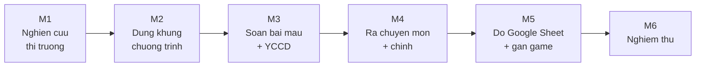

# 🧩 BẢNG CHIA VIỆC (Work Breakdown)

> **Ngày:** 15-07-2026
> **Repo:** dev-ops / task (bộ hồ sơ giao việc)
> **Loại:** Chia mốc, chia đầu việc, thứ tự & phụ thuộc — **KHÔNG áp thời gian**
> **Dùng khi:** Người thực hiện cần biết "làm gì trước, làm gì sau, nộp gì".
> **Đọc kèm:** file `04` (xây giáo trình) + file `08` (nguồn lực) + file `07` (nghiệm thu).

---

## 0. ⏱️ Về thời gian — nhân viên TỰ ƯỚC LƯỢNG

> **Bộ đề bài này KHÔNG áp deadline, KHÔNG chia tuần.**
>
> Sau khi đọc hết khối lượng công việc bên dưới, **nhân viên tự đánh giá mình cần bao lâu** cho từng mốc → **đề xuất tiến độ** lại cho quản lý duyệt. Tự ước lượng giúp bạn chủ động và cam kết đúng sức mình.
>
> Cách làm: đọc từng mốc M1→M6 → ước lượng "mốc này em cần khoảng bao lâu" → ghi vào cột trống → gửi quản lý chốt.

---

## 1. Cách đọc file này (1 phút)

Dự án chia thành **6 mốc lớn (Milestone)** — làm xong mốc này mới sang mốc sau. Mỗi mốc có:
- **Nội dung**: làm gì.
- **Sản phẩm bàn giao**: thứ cụ thể phải nộp ra khi xong mốc.

> 📌 **Thuật ngữ:** *Milestone (Mốc)* = một chặng lớn có kết quả rõ ràng. *Phụ thuộc* = việc này phải chờ việc kia xong mới làm được.

---

## 2. Sáu mốc lớn (Milestones)

| Mốc | Tên | Nội dung chính | Sản phẩm bàn giao | ⏱️ NV tự ước lượng |
| --- | --- | --- | --- | --- |
| **M1** | Nghiên cứu thị trường | Tìm hiểu đối thủ đang dạy Toán tư duy / Toán tiếng Anh mầm non ra sao; bố mẹ Việt cần gì | Báo cáo nghiên cứu ngắn + bảng so sánh đối thủ | ____ |
| **M2** | Dựng khung chương trình | Lập bộ khung 3 độ tuổi (3-4 / 4-5 / 5-6) × 2 môn — chia chủ đề, thứ tự bài (dễ → khó) | Khung chương trình dạng bảng (danh mục bài × độ tuổi) | ____ |
| **M3** | Soạn bài mẫu + YCCĐ | Soạn chi tiết các bài mẫu, mỗi bài gắn Yêu cầu cần đạt + độ khó + kỹ năng + lĩnh vực | Bộ bài mẫu hoàn chỉnh (đủ 3 độ tuổi × 2 môn) | ____ |
| **M4** | Rà chuyên môn + chỉnh | Chuyên gia mầm non soi lại: đúng luật chưa, vừa sức chưa, an toàn chưa → chỉnh sửa | Bản giáo trình đã sửa + biên bản rà soát | ____ |
| **M5** | Đổ Google Sheet + gắn game | Nhập giáo trình vào Google Sheet chuẩn, mỗi bài gắn game mini phù hợp | Google Sheet giáo trình hoàn chỉnh, đã gắn game | ____ |
| **M6** | Nghiệm thu | CEO + chuyên gia kiểm tra theo tiêu chí, chốt "đạt" | Biên bản nghiệm thu + bộ giáo trình bàn giao | ____ |



> **Lưu ý:** Làm **chắc từng mốc**, không nhảy cóc. Xong mốc trước mới sang mốc sau.

---

## 3. Bảng chia đầu việc chi tiết

Cột "Người làm" điền tên khi họp giao việc (mặc định: **NV** = nhân viên thực hiện chính; **CG** = chuyên gia mầm non; **CEO** = Mr. Đào; **Game** = đội game/kỹ thuật).

### Mốc M1 — Nghiên cứu thị trường
| Mã | Đầu việc | Người làm | Phụ thuộc |
| --- | --- | --- | --- |
| M1-1 | Liệt kê 5-7 đối thủ dạy Toán tư duy / Toán tiếng Anh mầm non | NV | — |
| M1-2 | Ghi lại cách họ chia độ tuổi, chủ đề, cách "học qua chơi" | NV | M1-1 |
| M1-3 | Hỏi/khảo sát nhanh nhu cầu bố mẹ (bố mẹ Việt muốn con học gì) | NV | — |
| M1-4 | Viết báo cáo nghiên cứu ngắn + bảng so sánh | NV | M1-1→M1-3 |

### Mốc M2 — Dựng khung chương trình
| Mã | Đầu việc | Người làm | Phụ thuộc |
| --- | --- | --- | --- |
| M2-1 | Đọc kỹ Chương trình GDMN Bộ GD-ĐT (VBHN 01/2021) phần Toán / Nhận thức | NV | M1 xong |
| M2-2 | Chốt danh sách chủ đề Toán tư duy cho từng độ tuổi | NV | M2-1 |
| M2-3 | Chốt danh sách chủ đề Toán tiếng Anh cho từng độ tuổi | NV | M2-1 |
| M2-4 | Sắp thứ tự bài (dễ → khó) cho 3 độ tuổi × 2 môn | NV | M2-2, M2-3 |
| M2-5 | CEO + CG duyệt khung trước khi soạn chi tiết | CEO, CG | M2-4 |

### Mốc M3 — Soạn bài mẫu + YCCĐ
| Mã | Đầu việc | Người làm | Phụ thuộc |
| --- | --- | --- | --- |
| M3-1 | Soạn bài mẫu Toán tư duy độ tuổi 3-4 (gắn YCCĐ, độ khó, kỹ năng, lĩnh vực) | NV | M2-5 |
| M3-2 | Soạn bài mẫu Toán tư duy độ tuổi 4-5 và 5-6 | NV | M3-1 |
| M3-3 | Soạn bài mẫu Toán tiếng Anh cả 3 độ tuổi | NV | M2-5 |
| M3-4 | Tự rà lại: mỗi bài đủ 4 nhãn chưa (YCCĐ/độ khó/kỹ năng/lĩnh vực) | NV | M3-1→M3-3 |

### Mốc M4 — Rà chuyên môn + chỉnh
| Mã | Đầu việc | Người làm | Phụ thuộc |
| --- | --- | --- | --- |
| M4-1 | Chuyên gia mầm non soi giáo trình theo checklist (đúng luật, vừa sức, an toàn) | CG | M3 xong |
| M4-2 | NV chỉnh sửa theo góp ý của chuyên gia | NV | M4-1 |
| M4-3 | Chuyên gia rà lại lần 2, xác nhận đạt | CG | M4-2 |

### Mốc M5 — Đổ Google Sheet + gắn game
| Mã | Đầu việc | Người làm | Phụ thuộc |
| --- | --- | --- | --- |
| M5-1 | Nhập giáo trình vào Google Sheet chuẩn (đúng cột, đúng mã) | NV | M4-3 |
| M5-2 | Rà kho game IruKa, chọn game phù hợp từng bài | NV, Game | M5-1 |
| M5-3 | Gắn game vào từng bài trong Sheet | NV | M5-2 |
| M5-4 | Kiểm tra lại toàn bộ Sheet: không thiếu bài, không lệch mã | NV | M5-3 |

### Mốc M6 — Nghiệm thu
| Mã | Đầu việc | Người làm | Phụ thuộc |
| --- | --- | --- | --- |
| M6-1 | CEO + CG kiểm tra theo tiêu chí nghiệm thu (file `07`) | CEO, CG | M5-4 |
| M6-2 | NV sửa nốt các điểm còn thiếu | NV | M6-1 |
| M6-3 | Ký biên bản nghiệm thu, bàn giao chính thức | CEO | M6-2 |

---

## 4. Nhịp báo cáo — không để "mất tích"

Báo cáo đều đặn giúp phát hiện tắc sớm.

| Loại báo cáo | Khi nào | Gửi qua đâu | Nội dung |
| --- | --- | --- | --- |
| **Báo cáo nhanh** | Đều đặn (tần suất **NV + quản lý thống nhất** lúc giao việc) | Kênh chat nhóm dự án | 3 dòng ngắn (mẫu dưới) |
| **Báo cáo mốc** | Mỗi khi xong 1 Milestone | Kênh chat nhóm + đính kèm sản phẩm bàn giao | Tóm tắt đã làm + link Sheet/file |

**Mẫu báo cáo nhanh (chép theo đúng khung này):**
```
📅 [Ngày]
1. Hôm qua làm gì:  ...
2. Hôm nay làm gì:  ...
3. Đang tắc gì:      ... (nếu không tắc, ghi "Không")
```

> 💡 **Quy tắc vàng:** Bị tắc thì **báo NGAY**, đừng ngồi im chờ tự gỡ. Người hỗ trợ (xem file `08`) sẽ gỡ giúp.

---

## 5. Ghi nhớ nhanh

1. Làm **tuần tự** theo mốc M1 → M6, xong mốc trước mới sang mốc sau.
2. Mỗi bài soạn ra phải đủ **4 nhãn** (YCCĐ / độ khó / kỹ năng / lĩnh vực).
3. **Thời gian mỗi mốc do NV tự ước lượng** rồi đề xuất quản lý — không có deadline áp sẵn.
4. Báo cáo đều đặn theo mẫu 3 dòng. Tắc là báo ngay.
5. Tiêu chí "coi như xong" nằm ở file `07` (nghiệm thu) — đọc trước để biết đích.
