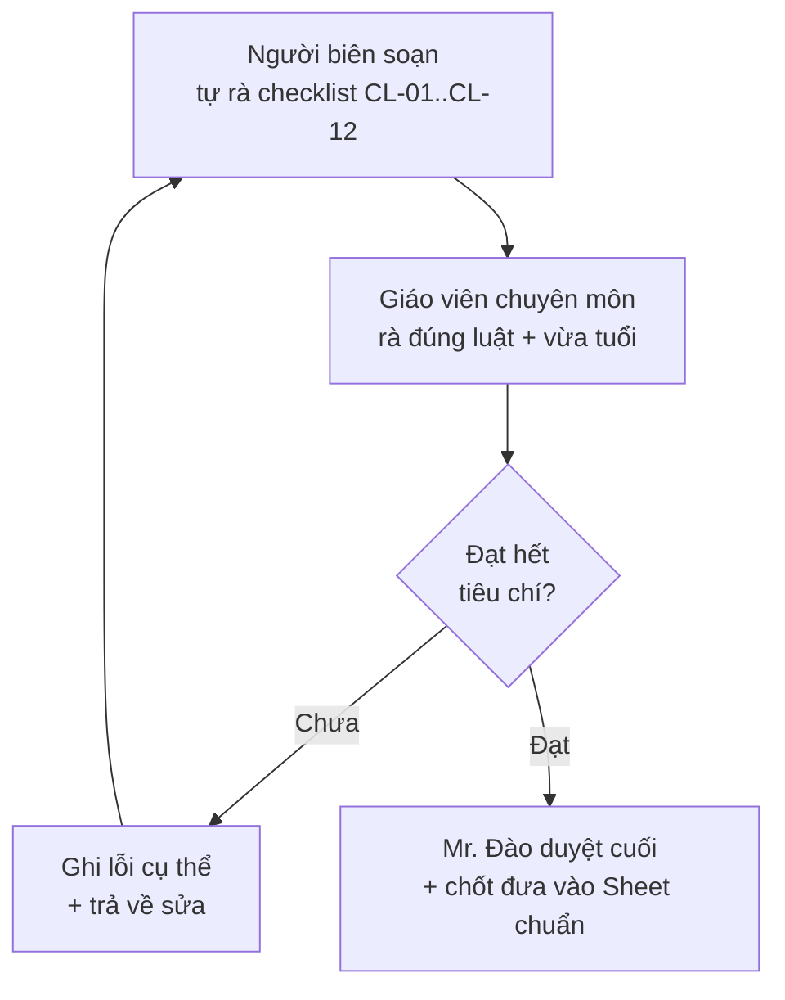

# 07 — Tiêu Chí Nghiệm Thu: Giáo Trình Toán Tư Duy & Toán Tiếng Anh (Mầm Non 3–6 tuổi)

> **Ngày:** 15-07-2026
> **Repo / Bối cảnh:** giao-viec — Giáo trình mầm non IruKa
> **Loại:** Tiêu chí nghiệm thu (Acceptance Criteria)
> **Đi kèm:** `02-prd-yeu-cau-chuong-trinh.md`

> 📖 **"Nghiệm thu" là gì?** Là bước **kiểm tra cuối cùng** để nói "việc này ĐẠT hay CHƯA ĐẠT". Tài liệu này định nghĩa rõ **thế nào là XONG** — để người làm biết đích, và người duyệt biết dựa vào đâu mà chấm. Không có tiêu chí rõ thì "xong" mỗi người hiểu một kiểu.

---

## 1. "XONG" nghĩa là gì?

Chúng ta có 2 cấp "xong": **xong 1 bài học** và **xong 1 hạng mục** (cả nhóm bài / cả danh mục).

### 1.1 XONG 1 BÀI HỌC — khi có đủ **10 thứ** dưới đây

| # | Thứ phải có | Đạt khi… |
| --- | --- | --- |
| 1 | **Mã bài** | Có mã bất biến đúng quy ước (vd `MTD-45-PATTERN-01`), không trùng bài khác. |
| 2 | **Tên bài** | Tiếng Việt dễ hiểu; môn Toán tiếng Anh có thêm tên tiếng Anh. |
| 3 | **Môn + độ tuổi** | Ghi rõ Toán tư duy / Toán tiếng Anh và 3–4 / 4–5 / 5–6. |
| 4 | **Kỹ năng chính** | Chọn đúng 1 kỹ năng từ danh mục chuẩn (PRD mục 4.1). |
| 5 | **Yêu cầu cần đạt (YCCĐ)** | Viết kiểu **đo được** ("bé chọn đúng nhóm nhiều hơn"), bám VBHN 01/2021. |
| 6 | **Mức Bloom** | Ghi Nhớ / Hiểu / Vận dụng, hợp với tuổi. |
| 7 | **Độ khó** | Ghi Làm quen / Củng cố / Nâng cao. |
| 8 | **Đề bài game mẫu** | Mô tả rõ bé phải làm gì trong game (1–3 câu). |
| 9 | **Gợi ý hình–âm thanh** | Có gợi ý tranh/con vật/âm thanh để bé **chưa biết đọc** vẫn hiểu đề. |
| 10 | **Nguồn tham khảo** | Trích rõ điều/mục chương trình Bộ GD hoặc tài liệu chuẩn được phép. |

> Riêng **môn Toán tiếng Anh**: bắt buộc thêm mục **từ vựng EN** (từ + nghĩa tiếng Việt + phát âm gợi ý), và **tối đa 1–3 từ mới/bài** (tránh quá tải).

### 1.2 XONG 1 HẠNG MỤC — khi…
- **Danh mục kỹ năng / từ vựng:** đủ đầu mục, mỗi mục có mã, không trùng, sắp từ dễ → khó.
- **Khung chương trình 1 môn × 1 tuổi:** phủ đủ các kỹ năng dự kiến, mạch đi từ dễ đến khó, số bài đúng con số Mr. Đào chốt (PRD Q1).
- **Bảng Google Sheet:** đủ cột chuẩn, mọi bài có mặt, định dạng sạch (không ô lỗi, không thiếu mã).

---

## 2. Tiêu chí từng hạng mục — dạng CHO – KHI – THÌ

> 📖 **CHO–KHI–THÌ (BDD)** là cách viết tiêu chí dễ kiểm: **CHO** (tình huống) → **KHI** (ai đó kiểm) → **THÌ** (kết quả bắt buộc phải thấy). Ai đọc cũng chấm giống nhau.

### HM-1 · Một bài Toán tư duy
> **CHO** 1 bài toán tư duy độ tuổi 4–5
> **KHI** giáo viên chuyên môn rà bài
> **THÌ** phải có đủ: tên bài, YCCĐ bám Bộ GD (đo được), mức Bloom, độ khó, kỹ năng chính, **1 đề bài game mẫu**, gợi ý hình–âm thanh, và nguồn tham khảo. Thiếu 1 mục = CHƯA ĐẠT.

### HM-2 · Một bài Toán tiếng Anh
> **CHO** 1 bài Toán tiếng Anh độ tuổi 5–6
> **KHI** giáo viên rà bài
> **THÌ** ngoài đủ các mục như HM-1, phải có **1–3 từ tiếng Anh** gắn đúng khái niệm toán bé đã biết bằng tiếng Việt, có phát âm gợi ý, và **không nhồi quá 3 từ mới**.

### HM-3 · Danh mục kỹ năng / từ vựng
> **CHO** danh mục kỹ năng Toán tư duy (hoặc từ vựng EN)
> **KHI** người duyệt kiểm
> **THÌ** mỗi mục có **mã bất biến duy nhất**, tên hiển thị để riêng, không trùng mã, sắp xếp từ dễ đến khó.

### HM-4 · Mạch dọc theo tuổi
> **CHO** cùng 1 kỹ năng (vd nhận biết mẫu) ở cả 3 tuổi
> **KHI** người duyệt soi mạch dọc
> **THÌ** độ khó phải **tăng dần** 3–4 → 4–5 → 5–6, **không nhảy cóc**, **không lặp y hệt**; mức Nâng cao tuổi nhỏ không vượt mức Làm quen tuổi lớn.

### HM-5 · Bảng Google Sheet chuẩn
> **CHO** bảng giáo trình trên Google Sheet
> **KHI** người duyệt mở bảng
> **THÌ** đủ các cột chuẩn (mã bài, tên, tuổi, môn, kỹ năng, YCCĐ, Bloom, độ khó, game, nguồn), **mọi bài có mặt**, không ô trống bắt buộc, không mã trùng.

### HM-6 · Gắn game
> **CHO** 1 bài đã soạn
> **KHI** người duyệt kiểm phần game
> **THÌ** bài chỉ rõ **loại game phù hợp** + **đề bài game mẫu** khớp với kỹ năng chính; nếu dùng lại game cũ thì ghi mã game, nếu đề xuất game mới thì mô tả rõ.

### HM-7 · Bé chưa biết đọc vẫn hiểu
> **CHO** 1 bài bất kỳ
> **KHI** thử hình dung 1 bé chưa biết chữ chơi bài đó
> **THÌ** bé phải hiểu đề **chỉ nhờ tranh + âm thanh + con vật**, không cần đọc chữ nào.

---

## 3. Bảng checklist chất lượng giáo trình

> Dùng bảng này rà **từng bài** hoặc **từng lô bài**. Chỉ khi tất cả cột đều ✅ mới coi là đạt.

| Mã | Tiêu chí chất lượng | Cách kiểm nhanh | Đạt? |
| --- | --- | --- | --- |
| CL-01 | **Đúng luật** (bám VBHN 01/2021) | YCCĐ đối chiếu được với điều/mục chương trình Bộ GD | ☐ |
| CL-02 | **Phủ đủ YCCĐ** | Các kỹ năng dự kiến của tuổi đó đều có bài, không sót | ☐ |
| CL-03 | **Vừa sức tuổi** | Bài không quá khó/dễ; giáo viên xác nhận hợp tuổi | ☐ |
| CL-04 | **Truy nguồn được** | Mỗi bài có ghi nguồn cụ thể, không "chép cảm tính" | ☐ |
| CL-05 | **Không vi phạm bản quyền** | Không chép nguyên văn sách; nội dung tự viết lại; hình có quyền dùng | ☐ |
| CL-06 | **Đo được** | YCCĐ viết kiểu quan sát được, không chung chung | ☐ |
| CL-07 | **Đúng cấu trúc bài** | Đủ 10 mục (mục 1.1); môn EN đủ phần từ vựng | ☐ |
| CL-08 | **Mã bất biến nhất quán** | Kỹ năng/bài/game gắn bằng mã, tên để riêng | ☐ |
| CL-09 | **An toàn cho trẻ** | Không hình ảnh bạo lực/đáng sợ; thân thiện | ☐ |
| CL-10 | **Bé chưa biết đọc hiểu được** | Đề dựa hình + âm thanh, không bắt đọc chữ | ☐ |
| CL-11 | **Mạch dọc liền lạc** | Cùng kỹ năng tăng khó dần theo tuổi | ☐ |
| CL-12 | **Song ngữ không quá tải** (môn EN) | ≤ 3 từ mới/bài, gắn khái niệm đã biết | ☐ |

---

## 4. Quy trình nghiệm thu (ai kiểm, theo thứ tự nào)

- **Bước 1:** Người biên soạn tự chấm checklist trước khi nộp (không nộp bài chưa tự rà).
- **Bước 2:** Giáo viên chuyên môn rà theo CHO–KHI–THÌ + checklist.
- **Bước 3:** Lỗi ghi **cụ thể** (bài nào, thiếu mục nào) rồi trả về sửa; sửa xong rà lại.
- **Bước 4:** Mr. Đào duyệt cuối và chốt đưa vào bảng chuẩn.

---

## 5. Điều kiện PASS toàn dự án

> Dự án chỉ coi là **HOÀN THÀNH** khi đủ **5 điều kiện** sau:

1. **Đủ số lượng:** đủ 6 khung (2 môn × 3 tuổi) + danh mục kỹ năng + danh mục từ vựng EN, với số bài đúng con số Mr. Đào đã chốt.
2. **Mọi bài đạt chất lượng:** 100% bài đã soạn qua checklist CL-01..CL-12 và được giáo viên rà PASS.
3. **Sạch bản quyền & truy nguồn:** không bài nào chép nguyên văn tài liệu có bản quyền; mọi bài có nguồn kiểm chứng được.
4. **Bảng chuẩn hoàn chỉnh:** toàn bộ giáo trình nằm trong Google Sheet đúng cột, gắn mã bất biến, không mã trùng, không ô lỗi.
5. **Mr. Đào duyệt cuối:** ký duyệt cho phép đưa vào hệ thống (để về sau gắn game + cho AI gợi ý).

---

_File này dùng chung với PRD `02-prd-yeu-cau-chuong-trinh.md`. Khi có tranh cãi "đã xong chưa", lấy tài liệu này làm căn cứ._
