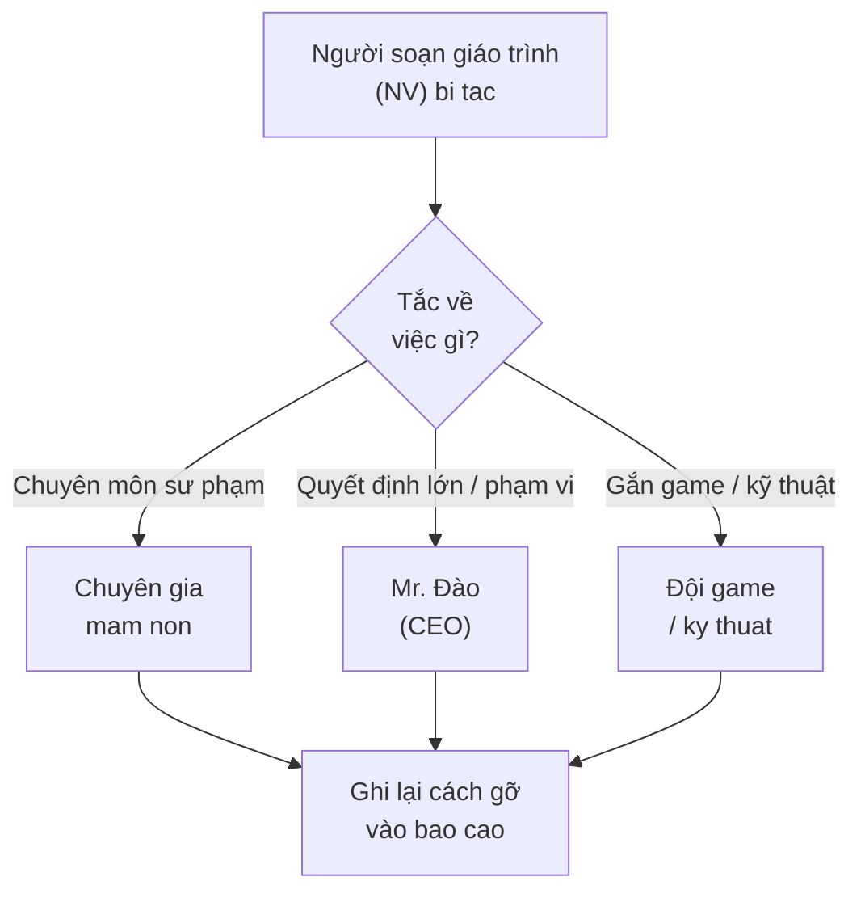

# 🧰 NGUỒN LỰC & CÔNG CỤ

> **Ngày:** 15-07-2026
> **Repo:** dev-ops / task (bộ hồ sơ giao việc)
> **Loại:** Nguồn lực — tài liệu tham chiếu, công cụ, người hỗ trợ khi tắc
> **Dùng khi:** Người thực hiện cần biết "lấy gì để làm, dùng công cụ nào, hỏi ai khi bí".
> **Đọc kèm:** file `03` (nghiên cứu thị trường) + file `04` (xây giáo trình).

---

## 1. Tài liệu tham khảo BẮT BUỘC có

Trước khi soạn một chữ nào, phải có sẵn trong tay các tài liệu gốc dưới đây. Đây là "luật" và "sách giáo khoa" — soạn giáo trình mà không bám các tài liệu này thì dễ sai chuẩn, không dùng được.

| # | Tài liệu | Là gì / vì sao cần | Ưu tiên |
| --- | --- | --- | --- |
| 1 | **Chương trình GDMN Bộ GD-ĐT — VBHN 01/2021** | Văn bản luật của Bộ Giáo dục về Giáo dục Mầm non. Quy định trẻ từng độ tuổi PHẢI đạt gì. Đây là chuẩn gốc, mọi bài học phải bám. | ⭐ Cao nhất |
| 2 | **SGK / tài liệu mầm non** (sách bài tập, sách hoạt động cho trẻ 3-6 tuổi) | Cho biết cách trình bày bài học thực tế, mức độ nội dung phù hợp từng tuổi. | ⭐ Cao |
| 3 | **Chuẩn phát triển trẻ 5 tuổi** (bộ chuẩn của Bộ GD-ĐT) | Danh sách cụ thể những gì trẻ 5 tuổi cần làm được — dùng để đối chiếu Yêu cầu cần đạt. | ⭐ Cao |
| 4 | **Kho tài liệu tham khảo của IruKa** | Giáo trình cũ + tài liệu nội bộ IruKa đã tích luỹ — tham khảo cách IruKa đã làm, tránh làm lại từ đầu. | Trung bình |

> 📌 **Cách tra "trẻ độ tuổi này cần đạt gì":** Mở tài liệu 1 (VBHN 01/2021), tìm phần **lĩnh vực Nhận thức** (Toán nằm ở đây) theo từng độ tuổi 3-4 / 4-5 / 5-6. Đối chiếu thêm tài liệu 3 cho độ tuổi 5-6. Nếu chưa tìm được bản mềm, hỏi người hỗ trợ ở mục 3.

---

## 2. Công cụ làm việc

| Công cụ | Dùng để làm gì | Ghi chú |
| --- | --- | --- |
| **Google Sheet** (bảng tính trực tuyến của Google) | Nơi soạn + lưu giáo trình chuẩn. Mỗi dòng 1 bài, các cột là YCCĐ / độ khó / kỹ năng / lĩnh vực / game. | Đây là "bản gốc" (nơi chuẩn nhất) của giáo trình. Ai cũng nhìn chung 1 file, sửa là thấy ngay. |
| **Công cụ tìm kiếm / AI hỗ trợ nghiên cứu** | Tra cứu đối thủ, cách dạy Toán tư duy, xu hướng mầm non (phục vụ Mốc M1). | Dùng để **tham khảo**, không chép nguyên. Luôn kiểm chứng thông tin trước khi tin. |
| **Kho tài liệu tham khảo IruKa** | Lấy lại mẫu, tránh làm trùng, học cách IruKa đã chuẩn hoá. | Xin quyền truy cập từ người hỗ trợ nếu chưa có. |

> 💡 **Về Google Sheet:** Cấu trúc cột chuẩn (đặt tên cột gì, gắn mã ra sao) nằm ở file `04` (xây giáo trình). Đọc file `04` TRƯỚC khi bắt đầu nhập Sheet, để nhập đúng ngay từ đầu, khỏi phải làm lại.

---

## 3. Người hỗ trợ khi tắc — hỏi ai, việc gì

Không ai làm một mình được tất cả. Khi bí, tìm đúng người:

| Người | Hỗ trợ việc gì | Khi nào tìm |
| --- | --- | --- |
| **Chuyên gia giáo dục mầm non** | Rà nội dung: bài này đúng luật chưa, vừa sức trẻ chưa, an toàn chưa, cách chơi hợp lứa tuổi không | Khi không chắc về chuyên môn sư phạm — nhất là Mốc M3, M4 |
| **Quản lý dự án — Mr. Đào (CEO)** | Quyết định lớn: đổi hướng, chốt phạm vi, duyệt khung chương trình, nghiệm thu | Khi cần "gật đầu" cho quyết định quan trọng, hoặc khi tắc mà chuyên gia không gỡ được |
| **Đội game / kỹ thuật** | Gắn game vào bài, biết game nào có sẵn trong kho, game nào hợp nội dung | Ở Mốc M5 (đổ Sheet + gắn game) |

> 🔔 **Nhắc lại quy tắc từ file `06`:** Tắc thì báo NGAY qua kênh chat nhóm, ghi rõ tắc ở đâu. Đừng ngồi im chờ tự gỡ.

---

## 4. Lưu ý AN TOÀN & bản quyền (đọc kỹ — quan trọng)

| Lưu ý | Nghĩa là gì | Vì sao |
| --- | --- | --- |
| **Khoá / tài khoản dùng riêng** | Mỗi người dùng tài khoản của mình. KHÔNG chia sẻ mật khẩu, KHÔNG dán khoá/mật khẩu vào file, chat, hay tài liệu chung. | Lộ khoá = người ngoài vào phá dữ liệu, mất an toàn cả hệ thống. |
| **Không đưa khoá lên nơi lưu code chung** | Tuyệt đối không "commit" (đẩy lên kho lưu trữ code chung) bất kỳ mật khẩu/khoá nào. | Kho code nhiều người xem → lộ khoá cho cả nhóm và có thể ra ngoài. |
| **Tài liệu có bản quyền: chỉ THAM KHẢO, không CHÉP** | Sách/giáo trình của người khác chỉ đọc để học cách làm. KHÔNG sao chép nguyên văn vào giáo trình IruKa. | Chép nguyên = vi phạm bản quyền, có thể bị kiện, và giáo trình không mang bản sắc IruKa. |
| **Tự viết lại bằng lời của mình** | Học ý tưởng → diễn đạt lại theo cách riêng, phù hợp trẻ Việt + phong cách IruKa. | Vừa tránh bản quyền, vừa ra sản phẩm chất lượng riêng. |

> 🛡️ Tóm 1 câu: **Khoá là của riêng — giữ kín. Tài liệu người khác — học chứ không chép.**

---

## 5. Nhắc đọc thêm

Để làm tốt, đọc theo trình tự các file trong cùng thư mục này:

| File | Nội dung | Đọc khi |
| --- | --- | --- |
| `03-nghien-cuu-thi-truong.md` | Cách nghiên cứu đối thủ + nhu cầu bố mẹ | Trước Mốc M1 |
| `04-xay-giao-trinh.md` | Cách xây khung + soạn bài + gắn nhãn + cấu trúc Google Sheet | Trước Mốc M2, M3, M5 |
| `05-ai-xuong-day-mau-giao.md` | Vì sao giáo trình phải chuẩn để AI dùng được | Đọc để hiểu "làm cho ai dùng" |
| `06-chia-viec.md` | Chia mốc, chia việc, phụ thuộc, nhịp báo cáo | Đọc để biết trình tự làm (thời gian tự ước lượng) |
| `07` (nghiệm thu) | Tiêu chí "coi như xong" | Đọc để biết đích cần đạt |

---

## 6. Ghi nhớ nhanh

1. Có đủ **3 tài liệu gốc** (VBHN 01/2021 + SGK mầm non + Chuẩn trẻ 5 tuổi) trước khi soạn.
2. Soạn giáo trình trên **Google Sheet** — cấu trúc cột theo file `04`.
3. Tắc chuyên môn → **chuyên gia mầm non**; quyết định lớn → **Mr. Đào**; gắn game → **đội game**.
4. **Khoá/tài khoản giữ kín**, không chia sẻ, không dán vào file/chat/code.
5. Tài liệu bản quyền **chỉ tham khảo, không chép** — tự viết lại bằng lời mình.
