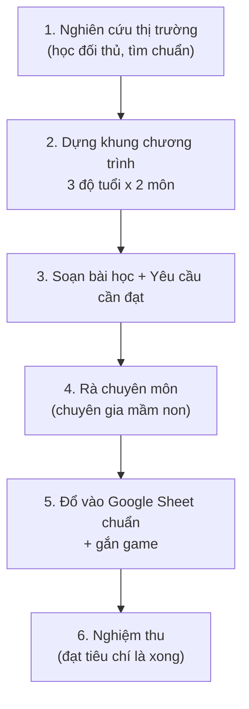

# 🎓 ĐỀ BÀI GIAO VIỆC — Giáo trình Toán Tư Duy + Toán Tiếng Anh Mầm Non (3–6 tuổi)

> **Đây là cổng vào bộ hồ sơ giao việc.** Người giao (Mr. Đào) và người nhận việc (nhân viên) đều đọc file này trước.
>
> **Ngày lập:** 15-07-2026 · **Người giao:** Mr. Đào (CEO IruKa) · **Chuẩn áp dụng:** Giao việc kiểu Big Tech (Google Design Doc + Amazon 6-pager + Meta PRD)

---

## 1. Dự án này là gì? (1 đoạn)

IruKa xây **giáo trình mới** cho trẻ **mầm non 3–6 tuổi** ở 2 môn:
1. **Toán tư duy** — không chỉ đếm số, mà rèn tư duy (nhận biết quy luật, phân loại, so sánh, số lượng, hình khối, không gian, suy luận logic).
2. **Toán tiếng Anh** — bé làm quen khái niệm toán + từ vựng toán bằng tiếng Anh (song ngữ).

Kèm định hướng **đưa AI xuống dạy ở mẫu giáo** — AI hỗ trợ bé + giáo viên học qua mini-game trên nền tảng IruKa.

> ⚠️ IruKa **chưa có kinh nghiệm** 2 mảng này → phải **nghiên cứu thị trường trước**, rồi xây bài bản, bám chuẩn Bộ Giáo dục.

---

## 2. Bộ hồ sơ gồm những gì? (đọc theo thứ tự)

| Thứ tự | File | Trả lời câu hỏi | Ai đọc kỹ |
|---|---|---|---|
| 📌 | Quy trình chung: workflow `/giao-de-bai-bigtech` (nằm ở `.agent/workflows/`) | *Cách giao việc chuẩn Big Tech* | Mr. Đào |
| 1️⃣ | `01-brief-du-an.md` | **TẠI SAO** làm + phạm vi (Why + Scope) | Cả 2 |
| 2️⃣ | `02-prd-yeu-cau-chuong-trinh.md` | **LÀM CÁI GÌ** — yêu cầu chi tiết giáo trình | Nhân viên |
| 3️⃣ | `03-huong-dan-nghien-cuu-thi-truong.md` | **Nghiên cứu ở đâu, thế nào** (cào tài liệu, đối thủ) | Nhân viên |
| 4️⃣ | `04-huong-dan-xay-giao-trinh-va-bai-hoc.md` | **Xây giáo trình & bài học ra sao** (+ bài mẫu) | Nhân viên |
| 5️⃣ | `05-ai-xuong-day-mau-giao.md` | **Đưa AI xuống dạy mẫu giáo** thế nào | Cả 2 |
| 6️⃣ | `06-chia-viec.md` | **LÀM GÌ TRƯỚC-SAU** — chia việc + phụ thuộc (thời gian NV tự ước lượng) | Cả 2 |
| 7️⃣ | `07-tieu-chi-nghiem-thu.md` | **ĐẠT là gì** — nghiệm thu (Cho–Khi–Thì) | Cả 2 |
| 8️⃣ | `08-nguon-luc-va-cong-cu.md` | Tài liệu, công cụ, hỏi ai khi tắc | Nhân viên |

---

## 3. Lộ trình làm việc tổng (nhìn 1 phát hiểu)

---

## 4. Nguyên tắc vàng khi làm (nhớ trước tiên)

- 🧒 **Lấy trẻ làm trung tâm, học qua chơi** — đúng độ tuổi, vừa sức, nhiều hình + âm thanh, ít chữ.
- 📚 **Bám chuẩn Bộ Giáo dục** (Chương trình GDMN — VBHN 01/2021) + không đi ngược khoa học sư phạm.
- ©️ **Tôn trọng bản quyền** — chỉ **tham khảo** cấu trúc/phương pháp của đối thủ, **KHÔNG chép** nội dung có bản quyền.
- 📊 **Mọi bài học phải đo được** — có Yêu cầu cần đạt rõ ràng + truy được nguồn.
- 🙋 **Tắc là hỏi ngay** — đừng đoán mò (xem `08-nguon-luc-va-cong-cu.md`).

---

> 📁 Task này nằm ở: `dev-ops/task/15-07-2026__giao-viec__giao-trinh-toan-tu-duy-toan-anh-mam-non-3-6/`
